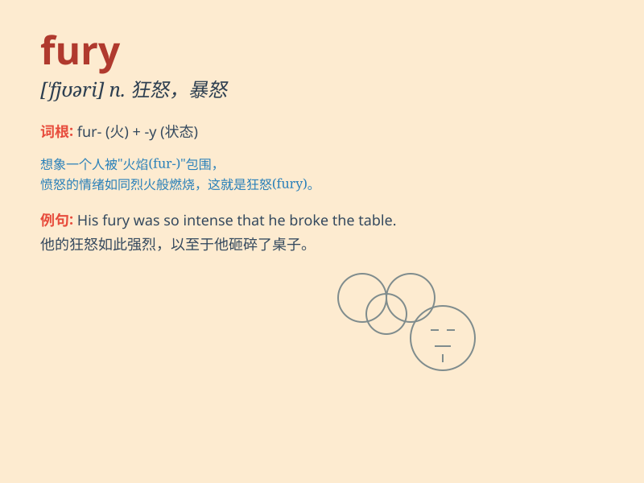

## fury

**英音:** _[\'fjʊərɪ]_ **美音:** _[\'fjʊri]_

**译义:** *n.狂怒,狂暴,激烈,狂怒的人,\<希神>复仇女神*

### 短语

+ **in a fury:** _愤怒地；狂怒地_

+ **fly into a fury:** _勃然大怒_

+ **the fury of the storm:** _暴风雨的狂暴_

+ **unleash one\'s fury:** _发泄怒火_

+ **fury and rage:** _愤怒和暴怒_

### 例句

#### 例句1

> **He was filled with fury when he saw the damage to his car.**

**中文翻译:** 当他看到他的车被损坏时，他非常愤怒。

**单词释义:** 愤怒

#### 例句2

> **The fury of the storm destroyed many houses.**

**中文翻译:** 狂暴的风暴摧毁了许多房屋。

**单词释义:** 狂怒；暴怒

#### 例句3

> **She vented her fury at the injustice.**

**中文翻译:** 她对不公正的事情发泄了愤怒。

**单词释义:** 愤怒；怒气

### 背诵小故事

> A warrior was captured by the enemy. His eyes showed fury as he
struggled to break free. He roared with all his strength, expressing his
intense anger and determination. Finally, he escaped and took revenge.

**一位战士被敌人俘虏了。他的眼中充满怒火，奋力挣脱。他全力怒吼，展现出强烈的愤怒和决心。最终，他逃脱并复仇了。**

### 图义

