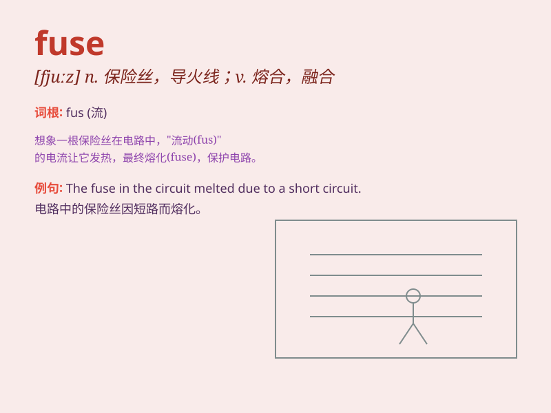

## fuse

**英音:** _[fjuːz]_ **美音:** _[fjuz]_

**译义:** *n.保险丝,熔丝v.熔合*

### 短语

+ **fuse box:** _保险丝盒_

+ **fuse wire:** _保险丝；熔丝_

+ **blow a fuse:** _勃然大怒_

+ **fuse together:** _熔合在一起_

+ **electric fuse:** _电保险丝_

### 例句

#### 例句1

> **The fuse blew and the lights went out.**

**中文翻译:** 保险丝烧断，灯灭了。

**单词释义:** 保险丝

#### 例句2

> **The two companies have decided to fuse.**

**中文翻译:** 两家公司已决定合并。

**单词释义:** 合并；融合

#### 例句3

> **The artist managed to fuse different styles of music.**

**中文翻译:** 这位艺术家成功地融合了不同风格的音乐。

**单词释义:** 融合；使结合

### 背诵小故事

> One day, a scientist was working in the lab. He needed to fuse two
metals together to create a new material. After many attempts and
adjustments, he finally succeeded. The fusion made a strong and unique
substance.

**有一天，一位科学家在实验室工作。他需要将两种金属融合在一起以创造一种新材料。经过多次尝试和调整，他终于成功了。这种融合产生了一种坚固且独特的物质。**

### 图义

