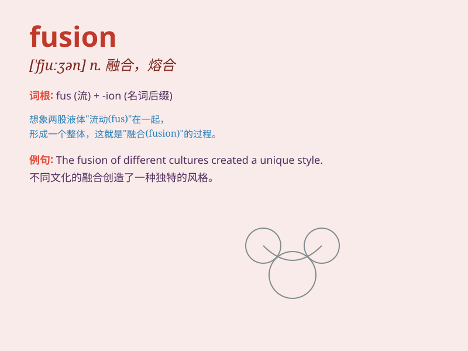

## fusion

**英音:** _[\'fjuːʒ(ə)n]_ **美音:** _[\'fjʊʒən]_

**译义:** *n.熔化,熔解,熔合,熔接*

### 短语

+ **nuclear fusion:** _核聚变_

+ **fusion reactor:** _聚变反应堆_

+ **fusion cuisine:** _融合菜；无国界料理_

+ **thermal fusion:** _热核聚变_

+ **fusion protein:** _融合蛋白_

### 例句

#### 例句1

> **The fusion of different cultures creates a rich and diverse
society.**

**中文翻译:** 不同文化的融合创造了一个丰富而多元化的社会。

**单词释义:** 融合

#### 例句2

> **Nuclear fusion is a potential source of clean energy in the
future.**

**中文翻译:** 核聚变是未来清洁能源的潜在来源。

**单词释义:** 融合；核聚变

#### 例句3

> **The band\'s music is a fusion of rock and jazz.**

**中文翻译:** 乐队的音乐融合了摇滚乐和爵士乐。

**单词释义:** 融合

### 背诵小故事

> Once upon a time, two scientists were working on an experiment. They
mixed different substances, hoping for a new discovery. Finally, they
achieved a perfect \'fusion\' and created a powerful material.

**从前，有两位科学家在做实验。他们混合不同的物质，希望有新的发现。最终，他们实现了完美的"融合"，创造出了一种强大的材料。**

### 图义

