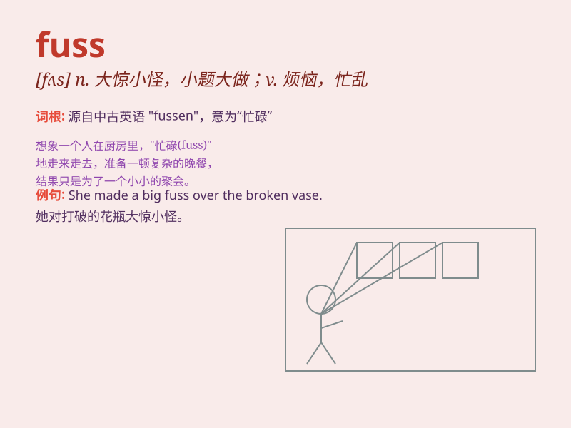

## fuss

**英音:** _[fʌs]_ **美音:** _[fʌs]_

**译义:** *n.忙乱,大惊小怪,大惊小怪的人v.忙乱,大惊小怪*

### 短语

+ **make a fuss:** _大惊小怪；小题大做_

+ **kick up a fuss:** _大吵大闹；起哄_

+ **fuss over:** _过分关心；过分照顾_

+ **fuss about:** _为\...焦虑；为\...操心_

+ **a lot of fuss:** _很多麻烦；很多吵闹_

### 例句

#### 例句1

> **Don\'t make such a fuss over a little scratch.**

**中文翻译:** 不要因为一点小划痕就大惊小怪。

**单词释义:** 大惊小怪；小题大做

#### 例句2

> **She always fusses about her appearance.**

**中文翻译:** 她总是很在意自己的外表。

**单词释义:** 过分在意；瞎操心

#### 例句3

> **There was a lot of fuss when the celebrity arrived.**

**中文翻译:** 当名人到来时，引起了很大的骚动。

**单词释义:** 骚动；忙乱

### 背诵小故事

> One day, Tom made a fuss when his favorite toy was broken. He shouted
and cried loudly. His mom came and comforted him, saying there was no
need to be in such a fuss. Later, Tom calmed down.

**一天，汤姆最喜欢的玩具坏了，他大吵大闹。他大声喊叫和哭泣。他的妈妈过来安慰他，说没必要这样大惊小怪。后来，汤姆平静下来了。**

### 图义

