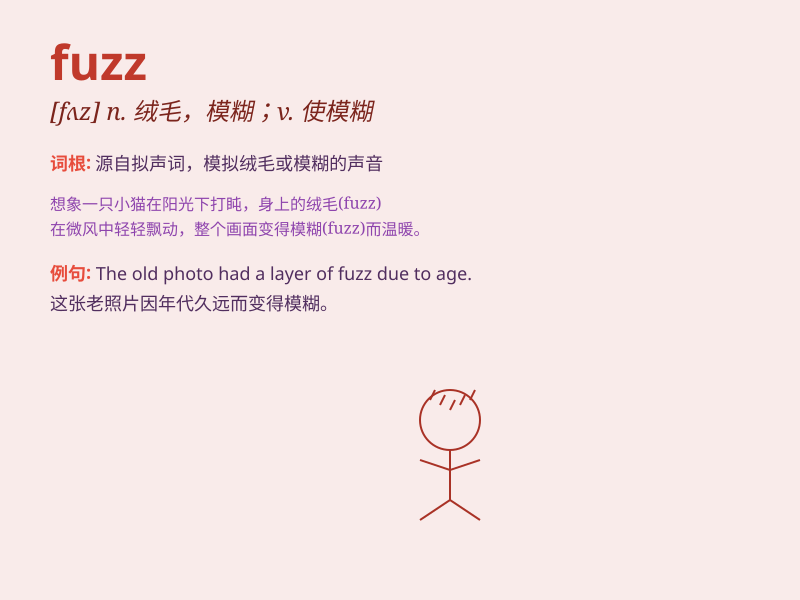

## fuzz

**英音:** _[fʌz]_ **美音:** _[fʌz]_

**译义:**
*n.细毛,绒毛,警员vi.变成绒毛状,作绒毛状飞散vt.起毛,使模糊*

### 短语

+ **fuzz ball:** _绒球_

+ **fuzz up:** _使模糊；使不清晰_

+ **fuzz hair:** _绒毛般的头发_

+ **fuzz factor:** _模糊因素_

+ **fuzz tone:** _模糊音；朦胧音_

### 例句

#### 例句1

> **The fuzz on the peach made my hands itchy.**

**中文翻译:** 桃子上的绒毛让我的手发痒。

**单词释义:** 绒毛；细毛

#### 例句2

> **The police are often referred to as the fuzz.**

**中文翻译:** 警察通常被称为"fuzz"。

**单词释义:** 警察

#### 例句3

> **There was a fuzz of hair on his chin.**

**中文翻译:** 他的下巴上有一缕毛发。

**单词释义:** 绒毛；细毛

### 背诵小故事

> A bee was flying around, and its fuzz got stuck on a flower. The fuzz
looked soft and fluffy. Later, a child saw it and wondered what this
soft thing was called. It was \'fuzz\'!

**一只蜜蜂飞来飞去，它身上的绒毛粘在了一朵花上。这些绒毛看起来又软又蓬松。后来，一个孩子看到了，好奇这种软软的东西叫什么。它叫"fuzz"！**

### 图义

