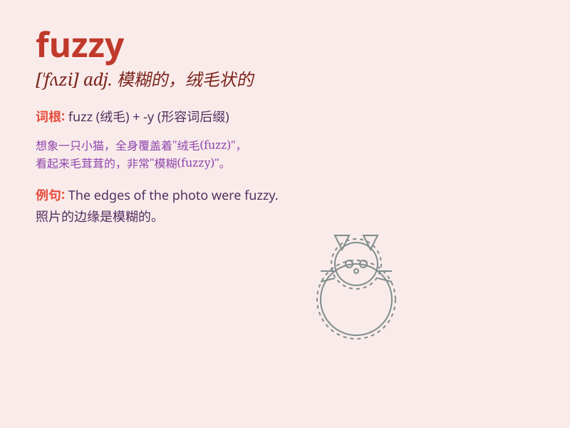

## fuzzy

**英音:** _[\'fʌzɪ]_ **美音:** _[\'fʌzi]_

**译义:** *adj.有绒毛的,模糊的,失真的*

### 短语

+ **fuzzy logic:** _模糊逻辑_

+ **fuzzy hair:** _毛茸茸的头发_

+ **fuzzy picture:** _模糊的图片_

+ **fuzzy memory:** _模糊的记忆_

+ **fuzzy thinking:** _模糊不清的想法_

### 例句

#### 例句1

> **The picture on the old TV was fuzzy.**

**中文翻译:** 旧电视上的图像很模糊。

**单词释义:** 模糊的

#### 例句2

> **My memory of that event is a little fuzzy.**

**中文翻译:** 我对那件事的记忆有点模糊。

**单词释义:** 模糊不清的

#### 例句3

> **The cat\'s fur felt fuzzy to the touch.**

**中文翻译:** 猫的毛摸起来毛茸茸的。

**单词释义:** 毛茸茸的

### 背诵小故事

> One day, I wore a fuzzy sweater and went to a party. Everyone said it
looked very warm and cute. The sweater\'s fuzz made me feel cozy.
\'Fuzzy\' means covered with soft, light hair or fibers.

**有一天，我穿着一件毛茸茸的毛衣去参加聚会。大家都说它看起来非常温暖可爱。毛衣的绒毛让我感到舒适。\'fuzzy\'意思是覆盖着柔软、轻的毛发或纤维。**

### 图义

