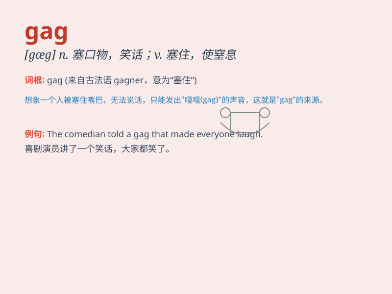

## gag

**英音:** _[gæg]_ **美音:** _[gæg]_

**译义:**
*n.塞口物,随口科白,打诨,箝口物,箝制言论,讨论终结vt.塞物于\...的口中,禁止,使窒息,使呕吐,压制言论自由,插科打诨,欺骗vi.窒息,作呕,欺骗,插科打诨*

### 短语

+ **gag order:** _（法院下达的）言论禁止令_

+ **gag reflex:** _咽反射；呕吐反射_

+ **gag gift:** _恶作剧礼物_

+ **gag law:** _限制言论自由的法令_

+ **gag up:** _（因紧张、恶心等）作呕_

### 例句

#### 例句1

> **The comedian\'s gag made the audience burst into laughter.**

**中文翻译:** 喜剧演员的笑点让观众哈哈大笑。

**单词释义:** 笑话；插科打诨

#### 例句2

> **The kidnapper put a gag on the victim\'s mouth to prevent him
from shouting.**

**中文翻译:** 绑匪将受害人的嘴堵住，不让他喊叫。

**单词释义:** 塞口物；堵住...的嘴

#### 例句3

> **The new law is just a political gag to win votes.**

**中文翻译:** 新法律只是为了赢得选票的政治噱头。

**单词释义:** 噱头；（政治）压制言论的手段

### 背诵小故事

> A clown was performing on stage. To make the audience laugh, he put a
gag in his mouth and pretended to be unable to speak. The gag was a
funny prop that added to the entertainment.

**一个小丑在舞台上表演。为了逗观众笑，他把一个塞口物放进嘴里，假装不能说话。这个塞口物是一个有趣的道具，增添了娱乐效果。**

### 图义

