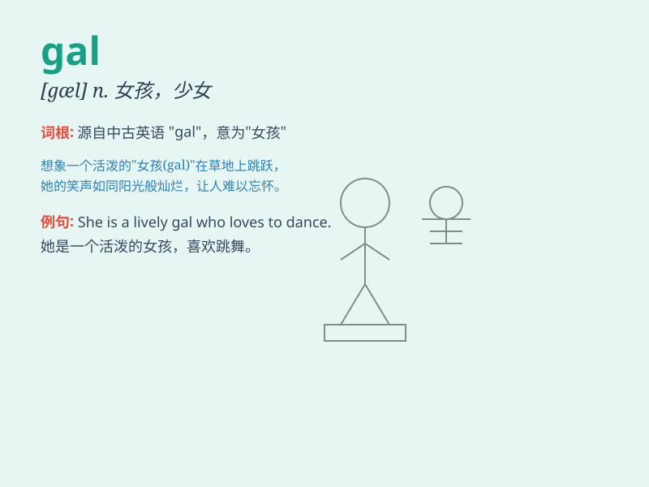

## gal

**英音:** _[gæl]_ **美音:** _[ɡæl]_

**译义:** *n.女孩(=girl),少女*

### 短语

+ **gal pal:** _女性朋友_

+ **gal friday:** _得力的女助手_

+ **gal about town:** _活跃于社交场合的女子_

+ **young gal:** _年轻女孩_

+ **pretty gal:** _漂亮的女孩_

### 例句

#### 例句1

> **The gal over there is my sister.**

**中文翻译:** 那边的女孩是我妹妹。

**单词释义:** 女孩

#### 例句2

> **She\'s a tough gal who never gives up easily.**

**中文翻译:** 她是一个坚强的女孩，从不轻易放弃。

**单词释义:** 女孩

#### 例句3

> **This gal has a great sense of humor.**

**中文翻译:** 这个女孩很有幽默感。

**单词释义:** 女孩

### 背诵小故事

> A young girl named Gal loved to explore the galaxy. Every time she
looked up at the stars, she felt a sense of wonder. Gal was brave and
determined to discover the mysteries of the universe.

**一个名叫加尔的年轻女孩喜欢探索星系。每次她仰望星空，都感到一阵惊奇。加尔勇敢且坚定地去探索宇宙的奥秘。**

### 图义

