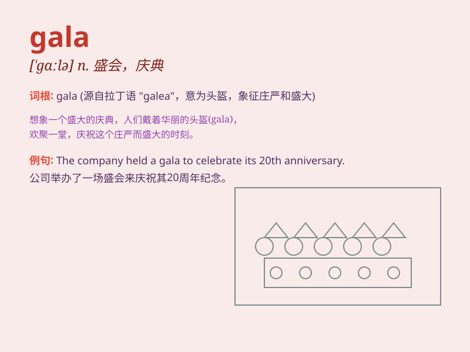

## gala

**英音:** _[\'gɑːlə; \'geɪlə]_ **美音:** _[\'ɡelə]_

**译义:** *n.节日,祝贺,特别娱乐 a:节日的,快乐的,庆祝的*

### 短语

+ **gala dinner:** _晚宴；盛宴_

+ **gala event:** _盛大活动；庆典_

+ **gala performance:** _精彩演出；盛会表演_

+ **charity gala:** _慈善晚会_

+ **music gala:** _音乐盛会_

### 例句

#### 例句1

> **The charity gala was a huge success, raising a lot of money for
the cause.**

**中文翻译:** 此次慈善晚会取得了巨大成功，为慈善事业筹集了大量善款。

**单词释义:** 盛会；庆典

#### 例句2

> **She wore a beautiful dress to the gala.**

**中文翻译:** 她穿着一件漂亮的裙子参加晚会。

**单词释义:** 庆典；盛会

#### 例句3

> **The annual company gala is coming up next month.**

**中文翻译:** 一年一度的公司晚会将于下个月举行。

**单词释义:** 庆典；聚会

### 背诵小故事

>
在一个盛大的节日（gala），人们盛装打扮，欢快跳舞。街道被装饰得五彩缤纷，美食摊位香气四溢。音乐声中，大家都沉浸在欢乐的氛围里，这就是令人难忘的gala。

**在一个盛大的节日，人们盛装打扮，欢快跳舞，街道装饰漂亮，有美食和音乐，大家沉浸在欢乐氛围里，这就是令人难忘的gala（盛会，庆典）。**

### 图义

