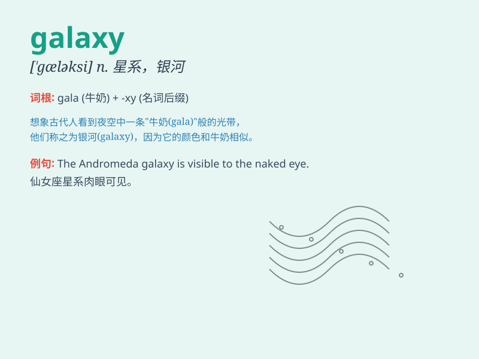

## galaxy

**英音:** _[\'gæləksɪ]_ **美音:** _[\'ɡæləksi]_

**译义:** *n.星系,银河,一群显赫的人,一系列光彩夺目的东西*

### 短语

+ **Milky Way Galaxy:** _银河系_

+ **Andromeda Galaxy:** _仙女座星系_

+ **galaxy cluster:** _星系团_

+ **active galaxy:** _活动星系_

+ **elliptical galaxy:** _椭圆星系_

### 例句

#### 例句1

> **The galaxy is filled with countless stars and planets.**

**中文翻译:** 这个星系充满了无数的恒星和行星。

**单词释义:** 星系

#### 例句2

> **She has a dress with a pattern of galaxies.**

**中文翻译:** 她有一件带有星系图案的连衣裙。

**单词释义:** 星系（图案）

#### 例句3

> **The discovery of a new galaxy excited astronomers.**

**中文翻译:** 新星系的发现让天文学家们兴奋不已。

**单词释义:** 星系

### 背诵小故事

> A long time ago, a little boy looked up at the night sky and saw
countless stars. He wondered what this beautiful group of stars was
called. His father told him it was a \'galaxy\'. From then on, he never
forgot this word.

**很久以前，一个小男孩抬头仰望夜空，看到了无数的星星。他好奇这美丽的群星叫什么。他的父亲告诉他这叫"星系"。从那以后，他再也没有忘记这个词。**

### 图义

