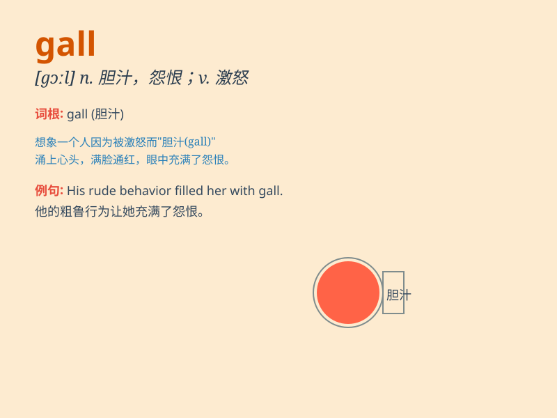

## gall

**英音:** _[gɔːl]_ **美音:** _[ɡɔl]_

**译义:**
*n.胆汁,恶毒,怨恨,五倍子,苦味,磨伤(尤指马的),肿痛,恼怒vt.磨伤,烦恼,屈辱vi.被磨伤*

### 短语

+ **gall bladder:** _胆囊_

+ **gall stone:** _胆结石_

+ **gall wasp:** _五倍子蜂_

+ **have the gall:** _厚颜无耻；胆敢_

+ **gall and wormwood:** _极苦恼的事；痛苦_

### 例句

#### 例句1

> **The constant criticism had begun to gall him.**

**中文翻译:** 持续不断的批评开始让他感到恼火。

**单词释义:** 使烦恼；使恼怒

#### 例句2

> **The saddle galled the horse\'s back.**

**中文翻译:** 马鞍擦伤了马背。

**单词释义:** 擦伤；擦痛

#### 例句3

> **Her insults were beginning to gall him.**

**中文翻译:** 她的侮辱开始让他感到恼火。

**单词释义:** 激怒；使愤怒

### 背诵小故事

> A brave knight was riding through a forest. Suddenly, his horse got a
gall on its back from a sharp branch. But the knight didn\'t give up and
continued his journey. The gall was a small setback but couldn\'t stop
him.

**一位勇敢的骑士正骑马穿过森林。突然，他的马背上被一根尖锐的树枝弄出了一个疮。但骑士没有放弃，继续前行。这个疮只是一个小挫折，无法阻挡他。**

### 图义

