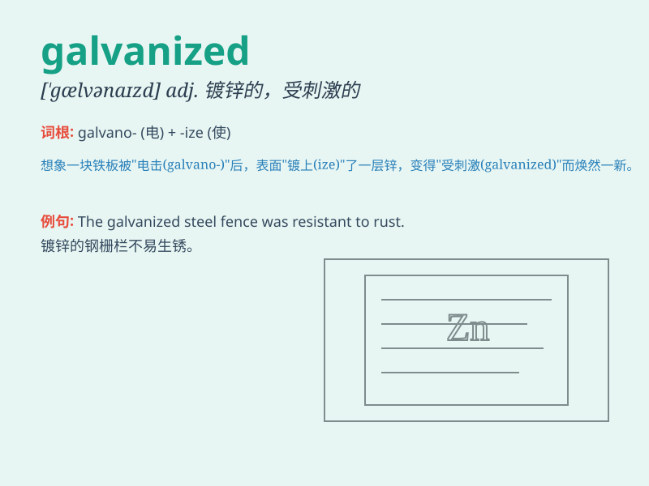

## galvanized

**英音:** _[ˈɡælvənaɪzd]_ **美音:** _[ˈɡælvənaɪzd]_

**译义:** *adj.镀锌的；电镀的；通电的*

### 短语

+ **galvanized iron:** _镀锌铁_

+ **galvanized steel:** _镀锌钢_

+ **galvanized sheet:** _镀锌薄板_

+ **galvanized pipe:** _镀锌管_

+ **galvanized wire:** _镀锌钢丝_

### 例句

#### 例句1

> **The news of the disaster galvanized the community into
action.**

**中文翻译:** 灾难的消息激励了社区采取行动。

**单词释义:** 激励；刺激

#### 例句2

> **His speech galvanized the audience\'s enthusiasm.**

**中文翻译:** 他的演讲激发了观众的热情。

**单词释义:** 激发

#### 例句3

> **The threat of losing their jobs galvanized the workers to
protest.**

**中文翻译:** 失去工作的威胁促使工人们进行抗议。

**单词释义:** 促使

### 背诵小故事

> A brave adventurer was lost in the wild. Suddenly, a lightning strike
galvanized him into action. He quickly found his way out. The shock of
the lightning made him move fast, just like being galvanized gives metal
a sudden boost of energy.

**一位勇敢的冒险家在野外迷路了。突然，一道闪电激励他行动起来。他很快找到了出路。闪电的冲击让他迅速行动，就像镀锌给金属突然的能量提升一样。**

### 图义

