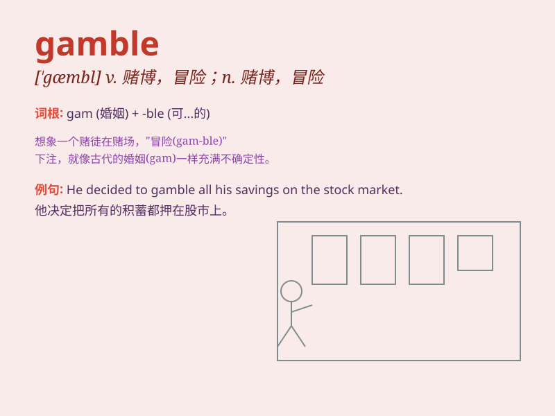

## gamble

**英音:** _[\'gæmb(ə)l]_ **美音:** _[\'ɡæmbl]_

**译义:** *n.冒险v.赌博,投机,孤注一掷*

### 短语

+ **gamble away:** _赌掉，输光_

+ **take a gamble:** _冒险尝试_

+ **gamble on:** _在\...\...上打赌_

+ **high-stakes gamble:** _高风险的赌博_

+ **political gamble:** _政治冒险_

### 例句

#### 例句1

> **He lost all his money in a gamble.**

**中文翻译:** 他在一次赌博中输光了所有的钱。

**单词释义:** 赌博

#### 例句2

> **It\'s a gamble whether the new business will succeed.**

**中文翻译:** 新业务是否会成功是一场冒险。

**单词释义:** 冒险；碰运气

#### 例句3

> **Don\'t gamble with your future.**

**中文翻译:** 不要拿你的未来冒险。

**单词释义:** 冒险；碰运气

### 背诵小故事

> A man named Tom was always eager to gamble. One day, he risked all
his money on a bet. But unfortunately, he lost everything. From then on,
he realized the danger of gambling.

**有个叫汤姆的人总是热衷于赌博。有一天，他把所有的钱都押在一个赌注上。但不幸的是，他输光了一切。从那以后，他意识到了赌博的危险。**

### 图义

