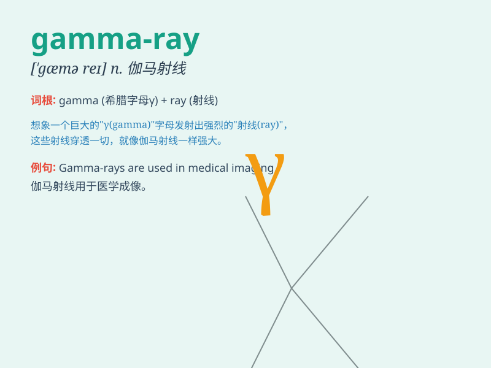

## gamma-ray

**英音:** _[ˈɡæmə ˌreɪ]_ **美音:** _[ˈɡæmə ˌreɪ]_

**译义:** *n.
伽马射线，一种高能电磁辐射，通常由放射性衰变产生，具有极强的穿透力。*

### 短语

+ **gamma-ray burst:** _伽马射线爆发_

+ **gamma-ray astronomy:** _伽马射线天文学_

+ **gamma-ray detector:** _伽马射线探测器_

+ **gamma-ray source:** _伽马射线源_

+ **gamma-ray spectrum:** _伽马射线谱_

### 例句

#### 例句1

> **The astronomers detected gamma-rays from a distant galaxy.**

**中文翻译:** 天文学家探测到了来自遥远星系的伽马射线。

**单词释义:** 伽马射线

#### 例句2

> **The gamma-ray burst was an extremely powerful event in the
universe.**

**中文翻译:** 伽马射线爆发是宇宙中极其强大的事件。

**单词释义:** 伽马射线

#### 例句3

> **Scientists are studying the properties of gamma-rays to
understand more about the cosmos.**

**中文翻译:** 科学家们正在研究伽马射线的特性，以更多地了解宇宙。

**单词释义:** 伽马射线

### 背诵小故事

> One day, a brave scientist was exploring deep in a cave. Suddenly, he
detected a mysterious light - the gamma-ray. It was like a magic beam
from another world, shining with unknown power and secrets.

**有一天，一位勇敢的科学家在洞穴深处探索。突然，他探测到一束神秘的光------伽马射线。它就像来自另一个世界的神奇光束，闪耀着未知的力量和秘密。**

### 图义

