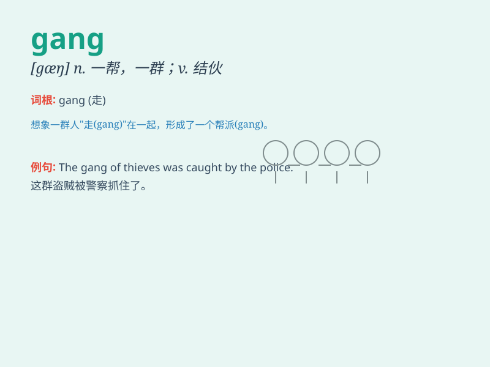

## gang

**英音:** _[gæŋ]_ **美音:** _[ɡæŋ]_

**译义:** *n.(一)伙,(一)群*

### 短语

+ **gang up:** _结伙；联合起来_

+ **gang together:** _聚集在一起；结成一伙_

+ **gang warfare:** _帮派争斗；团伙火并_

+ **street gang:** _街头帮派_

+ **prison gang:** _监狱帮派_

### 例句

#### 例句1

> **The gang of thieves was caught by the police.**

**中文翻译:** 这伙小偷被警察抓住了。

**单词释义:** 一伙，一帮（罪犯）

#### 例句2

> **He was attacked by a gang of youths.**

**中文翻译:** 他遭到了一帮年轻人的袭击。

**单词释义:** 一帮，一群（人）

#### 例句3

> **The workers are working in gangs.**

**中文翻译:** 工人们分组工作。

**单词释义:** 一组，一队（工人）

### 背诵小故事

> A gang of robbers planned to steal jewels from a store. But the
police were smart and caught them all. \'Gang\' here means a group of
people working together for bad things.

**一群强盗计划从一家商店偷珠宝。但警察很聪明，把他们都抓住了。这里的\'gang\'指的是为坏事而一起工作的一群人。**

### 图义

