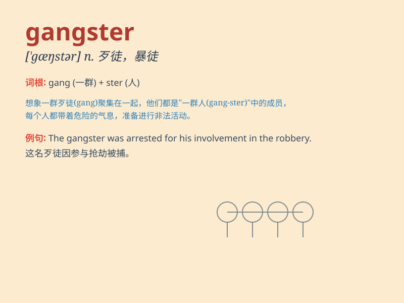

## gangster

**英音:** _[\'gæŋstə]_ **美音:** _[\'ɡæŋstɚ]_

**译义:** *n.\<美俗>歹徒,士匪,强盗*

### 短语

+ **organized gangster:** _有组织的歹徒_

+ **notorious gangster:** _臭名昭著的歹徒_

+ **local gangster:** _当地的歹徒_

+ **armed gangster:** _武装的歹徒_

+ **gangster film:** _黑帮电影_

### 例句

#### 例句1

> **The gangster was finally caught by the police after a long
chase.**

**中文翻译:** 经过长时间的追逐，这个歹徒最终被警察抓住了。

**单词释义:** 歹徒；强盗

#### 例句2

> **The movie depicts the life of a notorious gangster.**

**中文翻译:** 这部电影描绘了一个臭名昭著的歹徒的生活。

**单词释义:** 歹徒；流氓

#### 例句3

> **He was threatened by the gangster on the street.**

**中文翻译:** 他在街上受到了那个歹徒的威胁。

**单词释义:** 歹徒；匪帮成员

### 背诵小故事

> One night, a brave police officer was on patrol. Suddenly, a group of
men with fierce looks appeared. They were gangsters, causing trouble and
breaking the law. The officer was determined to catch them and restore
peace to the town.

**一天晚上，一位勇敢的警察正在巡逻。突然，一群面容凶恶的人出现了。他们是歹徒，惹是生非，违法乱纪。这位警察决心抓住他们，让小镇恢复安宁。**

### 图义

