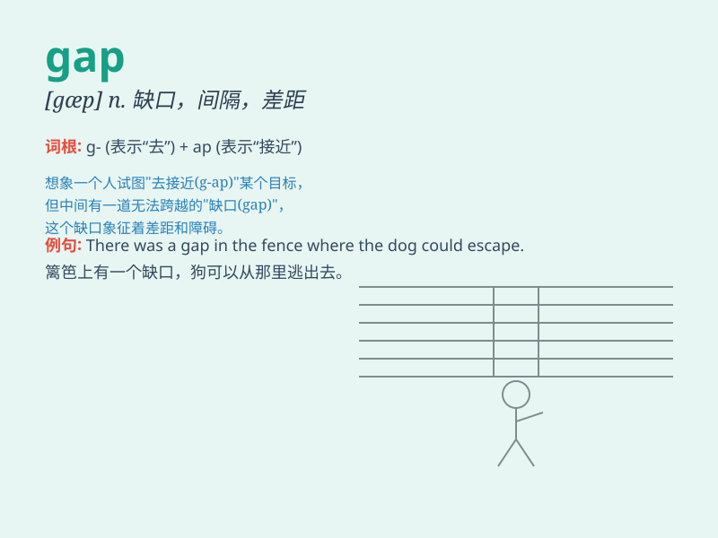

## gap

**英音:** _[gæp]_ **美音:** _[ɡæp]_

**译义:** *n.缺口,裂口,间隙,缝隙,差距,隔阂*

### 短语

+ **income gap:** _收入差距_

+ **generation gap:** _代沟_

+ **gap year:** _间隔年；空档年_

+ **trade gap:** _贸易差额；贸易逆差_

+ **credibility gap:** _信用差距；信任差距_

### 例句

#### 例句1

> **There is a wide gap between the rich and the poor.**

**中文翻译:** 富人和穷人之间有很大的差距。

**单词释义:** 差距；分歧

#### 例句2

> **The gap in the fence was just wide enough for the cat to squeeze
through.**

**中文翻译:** 篱笆上的缺口刚好够猫挤过去。

**单词释义:** 缺口；裂口

#### 例句3

> **He tried to bridge the gap in understanding between them.**

**中文翻译:** 他试图消除他们之间理解上的差距。

**单词释义:** 差距；隔阂

### 背诵小故事

> A little rabbit was running in the forest and suddenly came to a gap.
It was too wide for it to jump over. It had to find another way. The gap
was like a big problem that needed to be solved.

**一只小兔子在森林里跑，突然来到一个缺口。它太宽了，兔子跳不过去。它不得不另寻办法。这个缺口就像一个需要解决的大问题。**

### 图义

