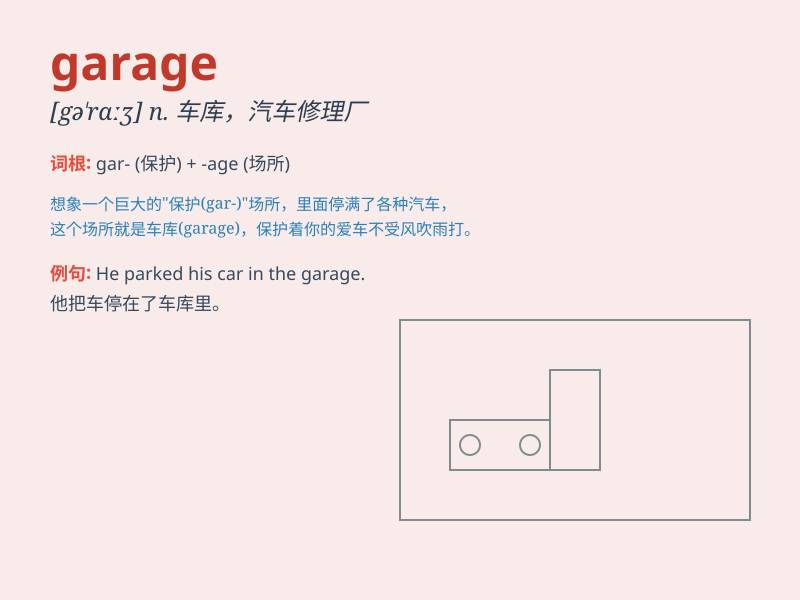

## garage

**英音:** _[ˈgærɑ:ʒ, ˈgærɪdʒ;]_ **美音:** _[gəˈrɑ:ʒ;
ɡəˈrɑʒ]_

**译义:** *n.汽车间,修车厂,车库v.放入车库*

### 短语

+ **garage sale:** _宅前旧货出售；在私家车库进行的旧物出售_

+ **underground garage:** _地下车库_

+ **parking garage:** _停车场_

+ **garage door:** _车库门_

+ **car garage:** _汽车库_

### 例句

#### 例句1

> **I parked my car in the garage.**

**中文翻译:** 我把车停在了车库里。

**单词释义:** 车库

#### 例句2

> **The mechanic is working in the garage.**

**中文翻译:** 机修工正在车库里工作。

**单词释义:** 车库

#### 例句3

> **He built a new garage for his house.**

**中文翻译:** 他为他的房子建了一个新的车库。

**单词释义:** 车库

### 背诵小故事

> One day, my car broke down. I had to take it to a special place
called a \'garage\'. The mechanics in the garage fixed my car quickly.
Now I know the garage is where cars get repaired and stored.

**有一天，我的车坏了。我不得不把它带到一个叫做"车库"的特殊地方。车库里的机械师很快修好了我的车。现在我知道车库是汽车修理和存放的地方。**

### 图义

