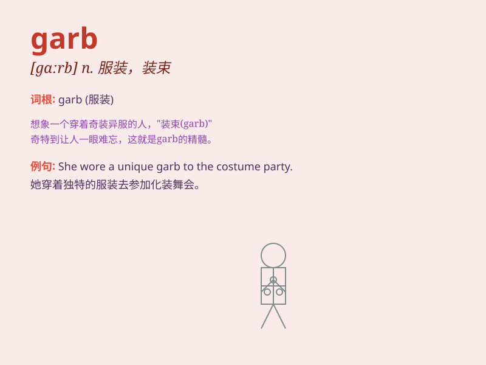

## garb

**英音:** _[gɑːb]_ **美音:** _[ɡɑrb]_

**译义:** *n.服装v.装扮*

### 短语

+ **in garb:** _穿着服装_

+ **strange garb:** _奇特的服装_

+ **traditional garb:** _传统服装_

+ **military garb:** _军装_

+ **clerical garb:** _牧师的服装_

### 例句

#### 例句1

> **She was dressed in strange garb.**

**中文翻译:** 她穿着奇怪的服装。

**单词释义:** 服装；服饰

#### 例句2

> **The knight wore shining garb for the tournament.**

**中文翻译:** 这位骑士为比赛穿上了闪亮的服装。

**单词释义:** 服装；装扮

#### 例句3

> **His garb suggested that he was from a foreign land.**

**中文翻译:** 他的穿着表明他来自异国他乡。

**单词释义:** 穿着；打扮

### 背诵小故事

> A thief was caught wearing strange garb. The police were puzzled by
his odd clothing. But finally, they recognized it was a disguise. Now
you remember, garb means clothing or dress.

**一个小偷被抓到时穿着奇怪的服装。警察对他古怪的衣服感到困惑。但最后，他们意识到这是伪装。现在你记住了，garb
意思是服装或服饰。**

### 图义

