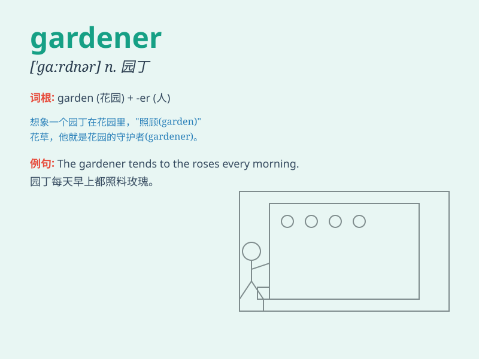

## gardener

**英音:** _[\'ɡɑːdənə]_ **美音:** _[\'gɑrdənɚ]_

**译义:** *n.园丁*

### 短语

+ **professional gardener:** _专业园丁_

+ **amateur gardener:** _业余园丁_

+ **experienced gardener:** _经验丰富的园丁_

+ **novice gardener:** _新手园丁_

+ **landscape gardener:** _景观园丁_

### 例句

#### 例句1

> **The gardener is pruning the roses in the garden.**

**中文翻译:** 园丁正在花园里修剪玫瑰。

**单词释义:** 园丁

#### 例句2

> **My father works as a gardener and takes care of the park.**

**中文翻译:** 我父亲是一名园丁，负责照料公园。

**单词释义:** 园丁

#### 例句3

> **The experienced gardener knows exactly when to plant the
seeds.**

**中文翻译:** 这位经验丰富的园丁确切地知道什么时候播种。

**单词释义:** 园丁

### 背诵小故事

> One day, a little boy was lost in a big garden. A kind gardener found
him and helped him find his way out. The gardener took care of the
plants with love and made the garden beautiful.

**有一天，一个小男孩在一个大花园里迷路了。一位善良的园丁发现了他，并帮助他找到了出去的路。这位园丁满怀爱心地照料着植物，让花园变得美丽。**

### 图义

