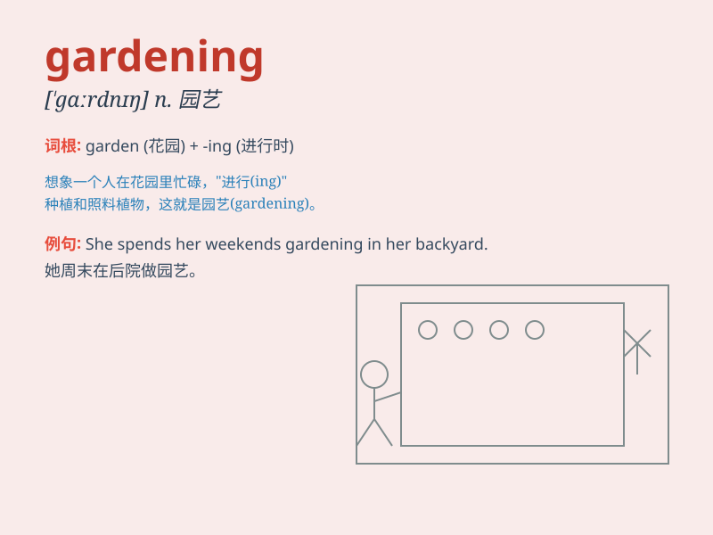

## gardening

**英音:** _[\'gɑːd(ə)nɪŋ]_ **美音:** _[\'gɑrdnɪŋ]_

**译义:** *n.园艺,造园,造园术,园林工人的工作*

### 短语

+ **landscape gardening:** _园林艺术_

+ **gardening tools:** _园艺工具_

+ **gardening gloves:** _园艺手套_

+ **gardening skills:** _园艺技能_

+ **indoor gardening:** _室内园艺_

### 例句

#### 例句1

> **I enjoy gardening in my spare time.**

**中文翻译:** 我在业余时间喜欢园艺。

**单词释义:** 园艺（活动）

#### 例句2

> **Gardening is a great way to relax.**

**中文翻译:** 园艺是一种很好的放松方式。

**单词释义:** 园艺

#### 例句3

> **She has a talent for gardening and her garden is always
beautiful.**

**中文翻译:** 她有园艺天赋，她的花园总是很漂亮。

**单词释义:** 园艺

### 背诵小故事

> One sunny day, I decided to start gardening. I put on my gloves,
grabbed my tools, and planted beautiful flowers. I watered them
carefully and watched them grow. Gardening made me feel so happy and
relaxed.

**在一个阳光明媚的日子，我决定开始园艺。我戴上手套，拿起工具，种了美丽的花。我认真浇水，看着它们生长。园艺让我感到非常快乐和放松。**

### 图义

