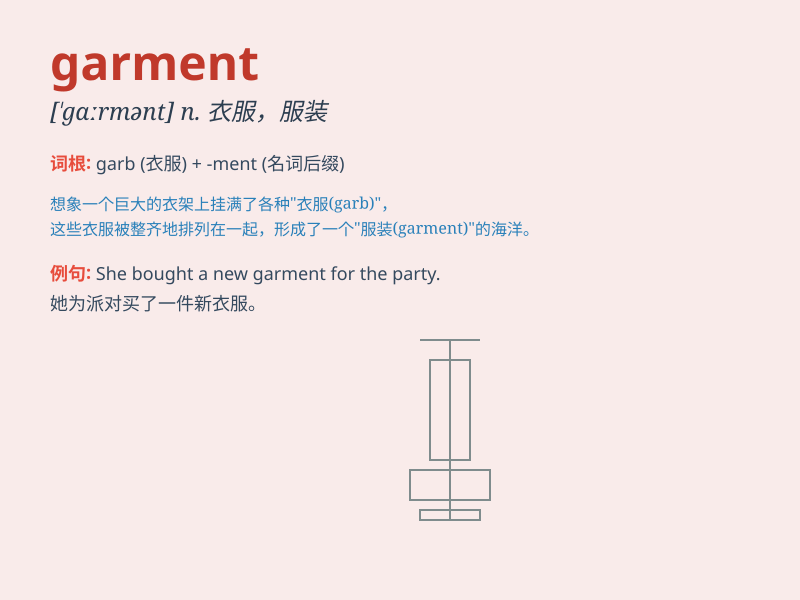

## garment

**英音:** _[\'gɑːm(ə)nt]_ **美音:** _[\'gɑrmənt]_

**译义:** *n.衣服,外衣,外表*

### 短语

+ **garment industry:** _服装业_

+ **garment factory:** _服装厂_

+ **garment worker:** _服装工人_

+ **garment design:** _服装设计_

+ **garment bag:** _服装袋_

### 例句

#### 例句1

> **She wore a beautiful garment to the party.**

**中文翻译:** 她穿着一件漂亮的衣服去参加聚会。

**单词释义:** 衣服

#### 例句2

> **The tailor is busy making garments for the customers.**

**中文翻译:** 这位裁缝正忙着为顾客做衣服。

**单词释义:** 衣服；服装

#### 例句3

> **This garment needs to be dry-cleaned.**

**中文翻译:** 这件衣服需要干洗。

**单词释义:** 衣服；服装

### 背诵小故事

> A thief broke into a store and stole only one garment, a beautiful
dress. But the police caught him quickly because the dress had a unique
mark. Now you remember \'garment\' means a piece of clothing.

**一个小偷闯进一家商店，只偷了一件衣服，一条漂亮的裙子。但警察很快就抓住了他，因为这条裙子有一个独特的标记。现在你记住'garment'意思是一件衣服。**

### 图义

