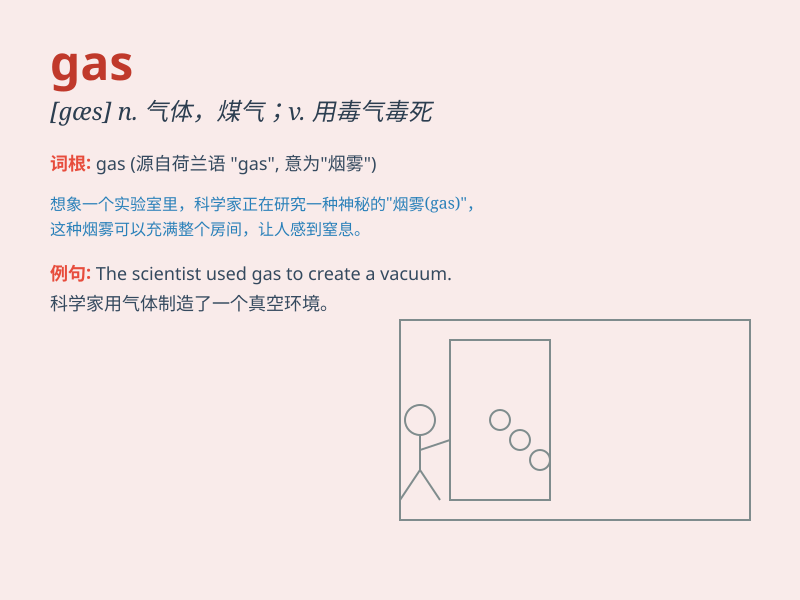

## gas

**英音:** _[ɡæs]_ **美音:** _[ɡæs]_

**译义:** *n.气体；煤气；汽油；毒气 vt.加油；毒（死）
vi.加油；放出气体；空谈*

### 短语

+ **gas station:** _加油站_

+ **gas stove:** _煤气炉_

+ **gas leak:** _煤气泄漏_

+ **natural gas:** _天然气_

+ **gas cylinder:** _煤气罐_

### 例句

#### 例句1

> **The car runs on gas.**

**中文翻译:** 这辆汽车靠汽油行驶。

**单词释义:** 汽油

#### 例句2

> **There was a gas leak in the building.**

**中文翻译:** 这座大楼里有煤气泄漏。

**单词释义:** 煤气；气体

#### 例句3

> **The price of gas has gone up again.**

**中文翻译:** 汽油价格又上涨了。

**单词释义:** 汽油

### 背诵小故事

> One day, I was driving my car, and suddenly the car stopped. I found
out that there was no gas left. I had to push the car to the nearest gas
station. Without gas, the car couldn\'t move!

**一天，我正在开车，突然车停了。我发现没汽油了。我不得不把车推到最近的加油站。没有汽油，车就动不了！**

### 图义

