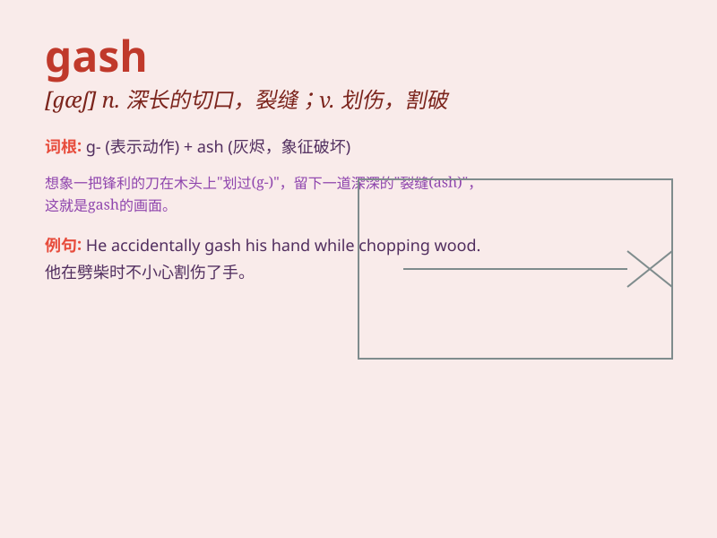

## gash

**英音:** _[gæʃ]_ **美音:** _[ɡæʃ]_

**译义:** *n.砍得很深的伤口,很深的裂缝v.(使)负深伤,划开,砍入很深*

### 短语

+ **gash in:** _在\...\...上划开一个口子_

+ **deep gash:** _深深的伤口_

+ **gash wound:** _划伤的伤口_

+ **nasty gash:** _严重的伤口_

+ **gash on the leg:** _腿上的伤口_

### 例句

#### 例句1

> **He got a deep gash on his leg when he fell off the bike.**

**中文翻译:** 他从自行车上摔下来，腿上划了一道很深的口子。

**单词释义:** 深长的伤口；切痕

#### 例句2

> **The thief used a knife to make a gash in the bag.**

**中文翻译:** 小偷用刀在袋子上划了一道口子。

**单词释义:** 切口；裂缝

#### 例句3

> **She accidentally gashed her finger while cutting vegetables.**

**中文翻译:** 她切菜时不小心割破了手指。

**单词释义:** 划伤；割破

### 背诵小故事

> A brave adventurer was exploring a dark cave. Suddenly, he slipped
and a sharp rock made a gash on his leg. Blood oozed out, but he
remained calm and bandaged the wound to continue his journey.

**一位勇敢的探险家正在探索一个黑暗的洞穴。突然，他滑倒了，一块锋利的石头在他腿上划了一道大口子。血渗了出来，但他保持冷静，包扎好伤口继续前行。**

### 图义

