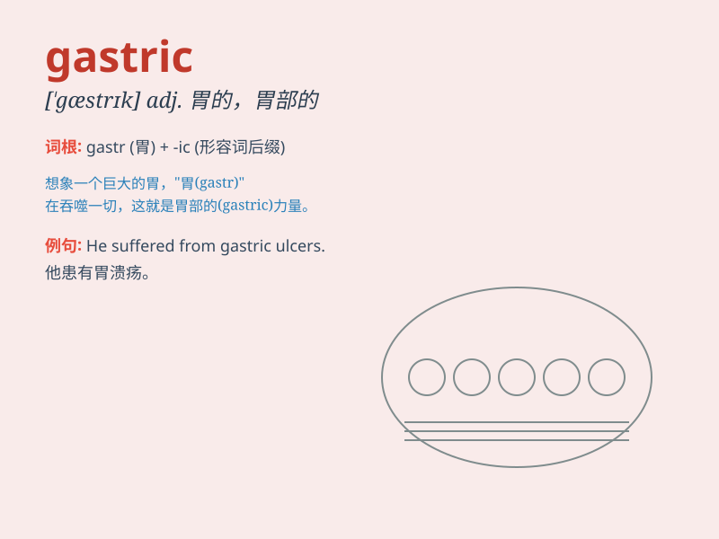

## gastric

**英音:** _[\'gæstrɪk]_ **美音:** _[\'gæstrɪk]_

**译义:** *adj.胃的*

### 短语

+ **gastric ulcer:** _胃溃疡_

+ **gastric juice:** _胃液_

+ **gastric pain:** _胃痛_

+ **gastric cancer:** _胃癌_

+ **gastric bypass:** _胃旁路手术_

### 例句

#### 例句1

> **He was diagnosed with gastric ulcer.**

**中文翻译:** 他被诊断出患有胃溃疡。

**单词释义:** 胃的；胃部的

#### 例句2

> **The doctor prescribed some medicine for her gastric problem.**

**中文翻译:** 医生为她的胃部问题开了一些药。

**单词释义:** 胃的；胃部的

#### 例句3

> **Gastric juices help in the digestion of food.**

**中文翻译:** 胃液有助于食物的消化。

**单词释义:** 胃的；与胃有关的

### 背诵小故事

> One day, a person had severe pain in his stomach. The doctor said it
was a gastric problem. The word \'gastric\' refers to anything related
to the stomach. So, remember, when you hear \'gastric\', think of
stomach issues.

**有一天，一个人胃部剧痛。医生说这是胃部问题。单词\'gastric\'指的是任何与胃有关的东西。所以，记住，当你听到\'gastric\'，就想到胃部问题。**

### 图义

