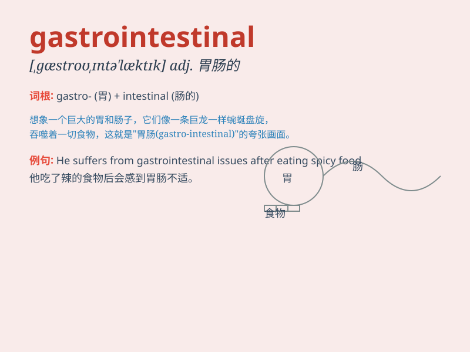

## gastrointestinal

**英音:** _[,gæstrəʊɪn\'testɪn(ə)l; -ɪntes\'taɪn(ə)l]_
**美音:** _[,ɡæstroɪn\'tɛstɪnl]_

**译义:** *adj.[解]胃与肠的*

### 短语

+ **gastrointestinal disorder:** _胃肠道疾病_

+ **gastrointestinal tract:** _胃肠道_

+ **gastrointestinal system:** _胃肠系统_

+ **gastrointestinal problem:** _胃肠问题_

+ **gastrointestinal infection:** _胃肠道感染_

### 例句

#### 例句1

> **The patient was diagnosed with a gastrointestinal disorder.**

**中文翻译:** 这位患者被诊断出患有胃肠道疾病。

**单词释义:** 胃肠道的

#### 例句2

> **Gastrointestinal problems can cause severe discomfort.**

**中文翻译:** 胃肠道问题可能会导致严重的不适。

**单词释义:** 胃肠道的

#### 例句3

> **The doctor prescribed medication to treat his gastrointestinal
symptoms.**

**中文翻译:** 医生开了药来治疗他的胃肠道症状。

**单词释义:** 胃肠道的

### 背诵小故事

> 想象一下，有个超级英雄叫
Gastro，他的任务是守护身体里的肠道（intestinal）。他在胃肠道（gastrointestinal）里勇敢战斗，保护消化健康。所以，gastrointestinal
就是胃肠道的意思。

**想象有个叫 Gastro 的超级英雄守护身体肠道，以此记住 gastrointestinal
表示胃肠道**

### 图义

