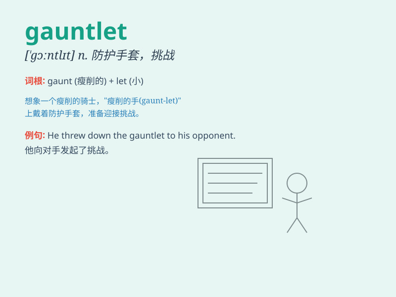

## gauntlet

**英音:** _[\'gɔːntlɪt]_ **美音:** _[\'gɔntlət]_

**译义:** *n.交叉射击*

### 短语

+ **run the gauntlet:** _受到严厉批评；遭受磨难_

+ **throw down the gauntlet:** _挑战；挑衅_

+ **pick up the gauntlet:** _接受挑战_

+ **cast the gauntlet:** _发出挑战_

+ **gauntlet of fire:** _严峻考验_

### 例句

#### 例句1

> **He had to run the gauntlet of angry protesters on his way to
work.**

**中文翻译:** 他在上班的路上不得不穿过愤怒的抗议者的人群。

**单词释义:** 一排人（准备攻击）；夹攻

#### 例句2

> **She threw down the gauntlet and challenged him to a race.**

**中文翻译:** 她向他挑战，要和他赛跑。

**单词释义:** 挑战；挑衅

#### 例句3

> **The knight wore a pair of gauntlets for protection.**

**中文翻译:** 这位骑士戴了一副护手甲来保护自己。

**单词释义:** （中世纪武士用的）金属手套

### 背诵小故事

> A brave knight had to run through a gauntlet of dangerous obstacles.
The gauntlet was a narrow path filled with fire and traps. But with his
courage, he succeeded. Remember, \'gauntlet\' means a challenging or
difficult situation.

**一位勇敢的骑士必须穿过充满危险障碍的挑战。这个挑战是一条狭窄的道路，布满了火焰和陷阱。但凭借他的勇气，他成功了。记住，\'gauntlet\'意思是具有挑战性或困难的情况。**

### 图义

