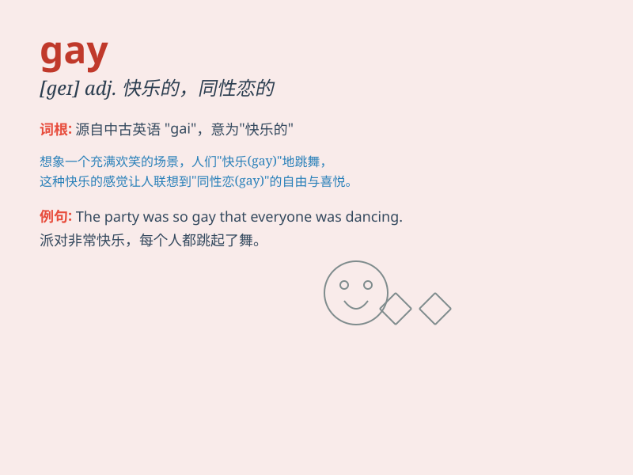

## gay

**英音:** _[geɪ]_ **美音:** _[ɡe]_

**译义:** *adj.欢迎的,\<美俚>同性恋的,放荡的,快乐的n.\<美俚>
同性恋者,尤指男性同性者*

### 短语

+ **gay pride:** _同性恋自豪_

+ **gay community:** _同性恋群体_

+ **gay rights:** _同性恋权利_

+ **gay bar:** _同性恋酒吧_

+ **gay couple:** _同性恋伴侣_

### 例句

#### 例句1

> **He is a gay man and proud of it.**

**中文翻译:** 他是一个同性恋者并且为此感到骄傲。

**单词释义:** 同性恋的（尤指男性）

#### 例句2

> **The party was full of gay laughter and joy.**

**中文翻译:** 聚会上充满了欢快的笑声和欢乐。

**单词释义:** 快乐的；愉快的

#### 例句3

> **She wore a gay dress to the wedding.**

**中文翻译:** 她穿着一件艳丽的连衣裙去参加婚礼。

**单词释义:** 鲜艳的；艳丽的

### 背诵小故事

> A young artist always wore colorful clothes and had a big smile. He
loved music and dance. People called him gay because he was happy and
lively all the time.

**一位年轻的艺术家总是穿着色彩鲜艳的衣服，脸上挂着大大的笑容。他热爱音乐和舞蹈。人们称他为
gay，因为他总是快乐又活泼。**

### 图义

