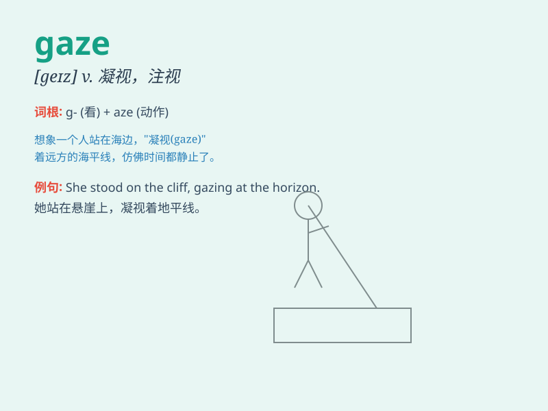

## gaze

**英音:** _[geɪz]_ **美音:** _[ɡeɪz]_

**译义:** *v.盯,凝视n.凝视*

### 短语

+ **gaze at:** _凝视，注视_

+ **fixed gaze:** _目不转睛的注视_

+ **gaze into:** _凝视着，注视着（内部）_

+ **admiring gaze:** _赞赏的目光_

+ **loving gaze:** _含情脉脉的注视_

### 例句

#### 例句1

> **She gazed at the beautiful sunset, lost in thought.**

**中文翻译:** 她凝视着美丽的日落，陷入沉思。

**单词释义:** 凝视

#### 例句2

> **He fixed his gaze on the distant mountain.**

**中文翻译:** 他目不转睛地盯着远处的山。

**单词释义:** 目不转睛地看

#### 例句3

> **The child gazed in wonder at the Christmas lights.**

**中文翻译:** 孩子惊奇地注视着圣诞灯。

**单词释义:** 注视

### 背诵小故事

> A brave knight was on a quest. When he reached a mysterious tower, he
stopped and gaze at it in awe. The tower\'s beauty and mystery captured
his attention completely.

**一位勇敢的骑士在执行任务。当他到达一座神秘的塔楼时，他停下来敬畏地凝视着它。塔楼的美丽和神秘完全吸引了他的注意力。**

### 图义

