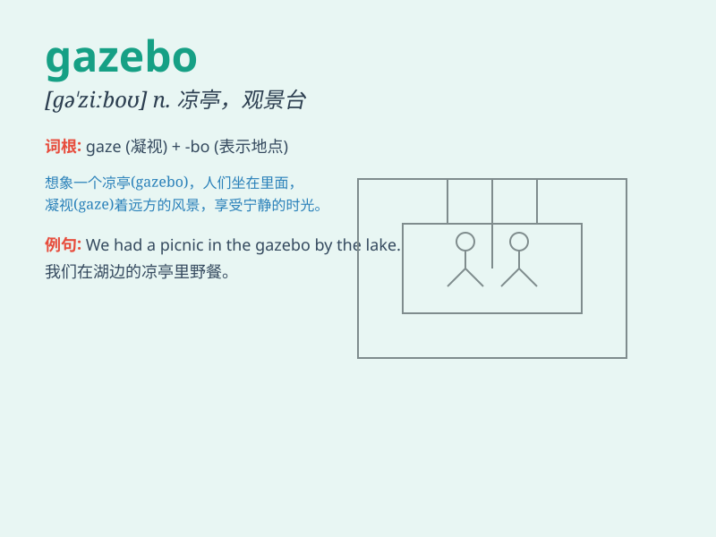

## gazebo

**英音:** _[gə\'ziːbəʊ]_ **美音:** _[ɡə\'zibo]_

**译义:** *n.眺望台,露台*

### 短语

+ **garden gazebo:** _花园中的观景亭_

+ **roofed gazebo:** _有顶的观景亭_

+ **wooden gazebo:** _木制的观景亭_

+ **ornate gazebo:** _华丽的观景亭_

+ **seaside gazebo:** _海边的观景亭_

### 例句

#### 例句1

> **We sat in the gazebo and enjoyed the beautiful view of the
garden.**

**中文翻译:** 我们坐在观景亭里，欣赏着花园的美丽景色。

**单词释义:** 观景亭

#### 例句2

> **The newly built gazebo became the favorite spot for the residents
to relax.**

**中文翻译:** 新建成的观景亭成了居民们最喜欢的放松场所。

**单词释义:** 观景亭

#### 例句3

> **They decorated the gazebo with colorful lights for the party.**

**中文翻译:** 他们为聚会用彩灯装饰了观景亭。

**单词释义:** 观景亭

### 背诵小故事

> A couple was having a picnic in a beautiful gazebo. They enjoyed the
view and the fresh air. Suddenly, a bird landed on the railing of the
gazebo. The gazebo became a memorable place for them.

**一对夫妇正在一个漂亮的观景亭里野餐。他们享受着美景和新鲜空气。突然，一只鸟落在了观景亭的栏杆上。这个观景亭成了他们难忘的地方。**

### 图义

