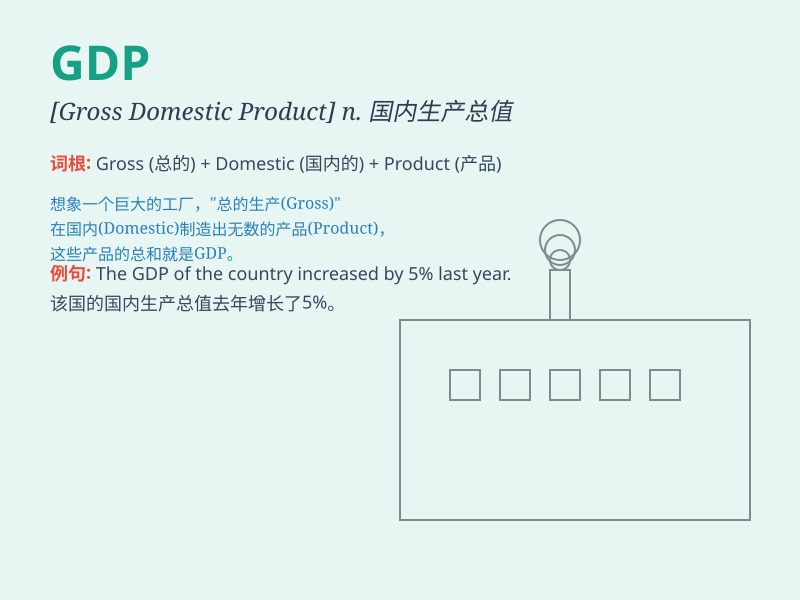

## GDP

**英音:** _[ˌdʒiːˈdiːˈpiː]_ **美音:** _[ˌdʒiːˈdiːˈpiː]_

**译义:** *缩写. 国内生产总值；国内总收入*

### 短语

+ **GDP growth:** _国内生产总值增长_

+ **GDP per capita:** _人均国内生产总值_

+ **GDP deflator:** _国内生产总值平减指数_

+ **nominal GDP:** _名义国内生产总值_

+ **real GDP:** _实际国内生产总值_

### 例句

#### 例句1

> **The GDP of this country has been steadily increasing over the
past few years.**

**中文翻译:** 这个国家的国内生产总值在过去几年一直在稳步增长。

**单词释义:** 国内生产总值

#### 例句2

> **Our economic policies aim to boost GDP and create more job
opportunities.**

**中文翻译:**
我们的经济政策旨在提高国内生产总值并创造更多的就业机会。

**单词释义:** 国内生产总值

#### 例句3

> **The GDP growth rate is an important indicator of a country\'s
economic performance.**

**中文翻译:** 国内生产总值增长率是一个国家经济表现的重要指标。

**单词释义:** 国内生产总值

### 背诵小故事

> 想象一个国家就像一个大公司，GDP
就像是这个公司的年度成绩单。它计算了一年内所有产品和服务的价值，就像统计公司卖出了多少东西赚了多少钱，能反映国家经济的强弱。

**想象一个关于国家如同大公司，GDP 类似年度成绩单的故事，用于辅助理解
GDP 的含义，它反映国家经济状况。**

### 图义

