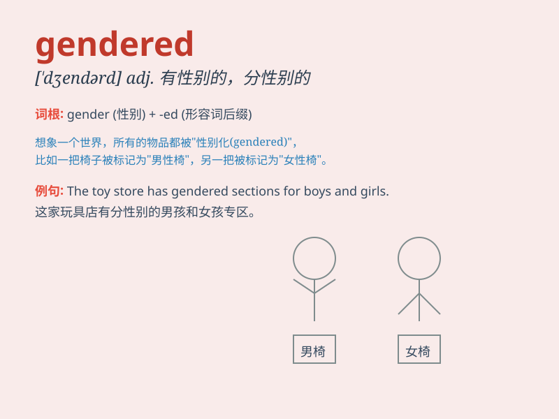

## gendered

**英音:** _[ˈdʒendəd]_ **美音:** _[ˈdʒendərd]_

**译义:** *adj. 有性别的；与性别有关的*

### 短语

+ **gendered language:** _性别语言_

+ **gendered division:** _性别分工_

+ **gendered perspective:** _性别视角_

+ **gendered roles:** _性别角色_

+ **gendered inequality:** _性别不平等_

### 例句

#### 例句1

> **The job advertisement was criticized for being gendered.**

**中文翻译:** 这份招聘广告因具有性别倾向而受到批评。

**单词释义:** 具有性别的；因性别而分化的

#### 例句2

> **We should avoid gendered language in our communication.**

**中文翻译:** 在我们的交流中，应该避免使用有性别区分的语言。

**单词释义:** 与性别有关的；基于性别的

#### 例句3

> **The study found that some toys are still highly gendered.**

**中文翻译:** 该研究发现，有些玩具仍然具有很强的性别特征。

**单词释义:** 有性别差异的；体现性别的

### 背诵小故事

> A prince and a princess were lost in a forest. The prince\'s clothes
were blue, and the princess\' were pink. This showed the gendered
difference in their outfits. Gendered means relating to gender.

**一位王子和一位公主在森林里迷路了。王子的衣服是蓝色的，公主的是粉色的。这显示出他们服装上与性别的相关差异。gendered
意思是与性别有关的。**

### 图义

