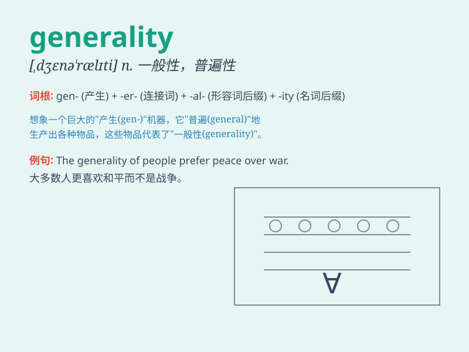

## generality

**英音:** _[dʒenə\'rælɪtɪ]_ **美音:** _[,dʒɛnə\'ræləti]_

**译义:** *n.一般性*

### 短语

+ **in generalities:** _泛泛地；笼统地_

+ **generalities of life:** _生活的一般性_

+ **avoid generality:** _避免笼统_

+ **mere generality:** _纯粹的一般性_

+ **speak in generality:** _笼统地说_

### 例句

#### 例句1

> **The statement was full of generality and lacked specific
details.**

**中文翻译:** 该声明充满了笼统性，缺乏具体细节。

**单词释义:** 笼统；一般性

#### 例句2

> **We should avoid generality when discussing important issues.**

**中文翻译:** 在讨论重要问题时，我们应该避免笼统。

**单词释义:** 一般性；普遍性

#### 例句3

> **His argument was based on generality rather than concrete
evidence.**

**中文翻译:** 他的论点是基于一般性而非具体证据。

**单词释义:** 一般性；普遍情况

### 背诵小故事

> A king wanted to understand the general situation of his kingdom. But
his advisors always gave him generality and no specific details. So, he
decided to explore by himself. Finally, he knew the true generality of
his land.

**一位国王想要了解他王国的总体情况。但他的顾问总是给他笼统的信息，没有具体细节。所以，他决定自己去探索。最后，他了解了自己土地的真实概况。**

### 图义

