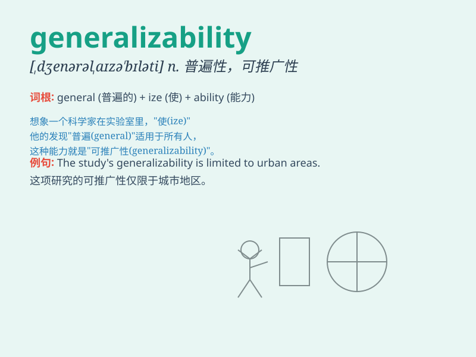

## generalizability

**英音:** _[ˌdʒenərəlaɪzə\'bɪləti]_ **美音:**
_[ˌdʒenərəlaɪzə\'bɪləti]_

**译义:** *n. 普遍性；概括性；可推广性*

### 短语

+ **assess generalizability:** _评估普遍性_

+ **limited generalizability:** _有限的普遍性_

+ **study generalizability:** _研究普遍性_

+ **question generalizability:** _质疑普遍性_

+ **improve generalizability:** _提高普遍性_

### 例句

#### 例句1

> **The generalizability of this study\'s findings is limited by the
small sample size.**

**中文翻译:** 这项研究结果的普遍适用性因样本量小而受到限制。

**单词释义:** 普遍适用性

#### 例句2

> **We need to consider the generalizability of this new teaching
method to other schools.**

**中文翻译:** 我们需要考虑这种新教学方法对其他学校的普遍适用性。

**单词释义:** 普遍适用性

#### 例句3

> **The generalizability of her theory remains questionable in
different cultural contexts.**

**中文翻译:** 她的理论在不同文化背景下的普遍适用性仍然存在疑问。

**单词释义:** 普遍适用性

### 背诵小故事

> A scientist was working hard to prove the generalizability of his new
theory. He tested it in various conditions and locations. Finally, his
theory could be applied widely, showing its great generalizability.

**一位科学家努力证明他新理论的普遍适用性。他在各种条件和地点进行测试。最终，他的理论能被广泛应用，显示出其强大的普遍适用性。**

### 图义

