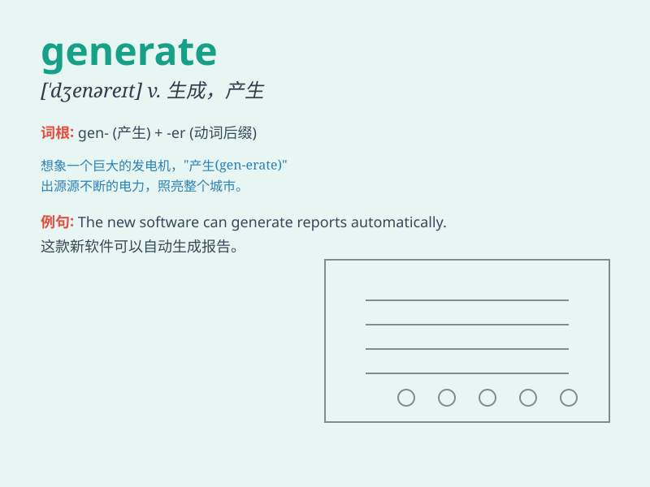

## generate

**英音:** _[\'dʒenəreɪt]_ **美音:** _[\'dʒɛnəret]_

**译义:** *vt.产生,发生*

### 短语

+ **generate electricity:** _发电_

+ **generate heat:** _产生热量_

+ **generate income:** _创造收入_

+ **generate interest:** _引起兴趣_

+ **generate ideas:** _产生想法_

### 例句

#### 例句1

> **The power plant generates electricity for the entire city.**

**中文翻译:** 该发电厂为整个城市提供电力。

**单词释义:** 产生；生成

#### 例句2

> **This new policy is expected to generate more job
opportunities.**

**中文翻译:** 这项新政策预计将创造更多就业机会。

**单词释义:** 创造；引起

#### 例句3

> **The software can generate reports automatically.**

**中文翻译:** 该软件可以自动生成报告。

**单词释义:** 生成；产生

### 背诵小故事

> A scientist was in a laboratory. He used special equipment and
chemicals to generate a new kind of energy. This energy could solve many
problems. The process was complex but exciting!

**一位科学家在实验室里。他使用特殊的设备和化学物质来产生一种新的能量。这种能量可以解决许多问题。这个过程很复杂但令人兴奋！**

### 图义

