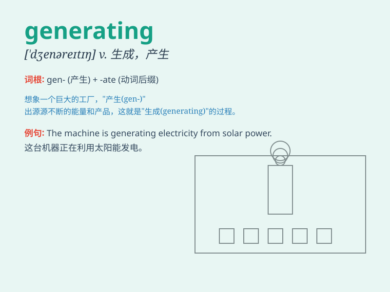

## generating

**英音:** _[ˈdʒenəreɪtɪŋ]_ **美音:** _[ˈdʒenəreɪtɪŋ]_

**译义:** *生成，产生（正在发生的过程或动作）；例：They are
generating new ideas for the project.（他们正在为项目产生新的想法。）*

### 短语

+ **generating station:** _发电站_

+ **generating capacity:** _发电容量；发电量_

+ **generating function:** _生成函数_

+ **generating set:** _生成集_

+ **generating mechanism:** _生成机制_

### 例句

#### 例句1

> **The power plant is generating electricity at full capacity.**

**中文翻译:** 这家发电厂正在全力发电。

**单词释义:** 产生；生成

#### 例句2

> **The new software is generating a lot of interest among users.**

**中文翻译:** 这款新软件在用户中引起了很大的兴趣。

**单词释义:** 引起；导致

#### 例句3

> **They are generating ideas for the project.**

**中文翻译:** 他们正在为这个项目出点子。

**单词释义:** 产生；形成

### 背诵小故事

> A power plant is generating electricity. Workers are busy ensuring
the smooth process. The turbines are spinning fast, generating huge
amounts of power to light up our cities.

**一家发电厂正在发电。工人们正忙于确保流程顺畅。涡轮机快速旋转，产生大量电力来照亮我们的城市。**

### 图义

