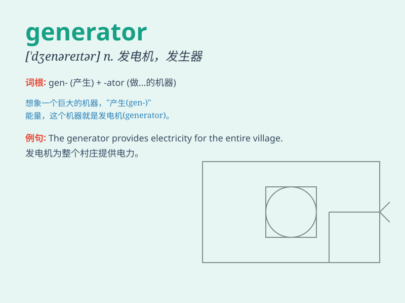

## generator

**英音:** _[\'dʒenəreɪtə]_ **美音:** _[\'dʒɛnəretɚ]_

**译义:** *n.发电机,发生器*

### 短语

+ **power generator:** _发电机_

+ **random number generator:** _随机数生成器_

+ **signal generator:** _信号发生器_

+ **steam generator:** _蒸汽发生器_

+ **voltage generator:** _电压发生器_

### 例句

#### 例句1

> **The generator broke down during the power outage.**

**中文翻译:** 停电期间发电机坏了。

**单词释义:** 发电机

#### 例句2

> **This software is a random number generator.**

**中文翻译:** 该软件是一个随机数生成器。

**单词释义:** 生成器

#### 例句3

> **The wind turbine acts as a clean energy generator.**

**中文翻译:** 风力涡轮机充当清洁能源发电机。

**单词释义:** 发生器

### 背诵小故事

> A scientist was working hard in the lab to invent a new machine. This
machine, called the \'generator\', could produce a huge amount of
electricity to light up the whole city. With it, darkness was no longer
a problem.

**一位科学家在实验室里努力工作，想要发明一种新机器。这台被称为"发电机"的机器能够产生大量的电来照亮整个城市。有了它，黑暗不再是问题。**

### 图义

