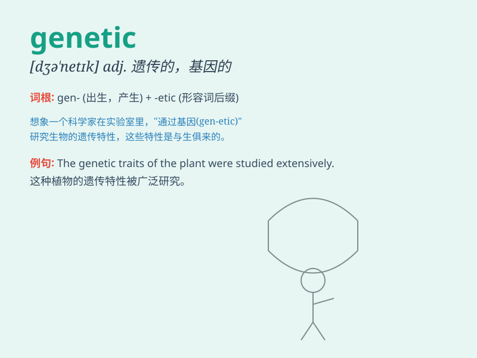

## genetic

**英音:** _[dʒɪ\'netɪk]_ **美音:** _[dʒə\'nɛtɪk]_

**译义:** *adj.遗传的,起源的*

### 短语

+ **genetic code:** _遗传密码_

+ **genetic engineering:** _遗传工程_

+ **genetic disorder:** _遗传疾病_

+ **genetic material:** _遗传物质_

+ **genetic variation:** _遗传变异_

### 例句

#### 例句1

> **Genetic factors play a significant role in determining a
person\'s height.**

**中文翻译:** 遗传因素在决定一个人的身高方面起着重要作用。

**单词释义:** 遗传的

#### 例句2

> **The doctor studied the patient\'s genetic makeup to understand
the disease.**

**中文翻译:** 医生研究患者的基因组成以了解这种疾病。

**单词释义:** 基因的

#### 例句3

> **Genetic engineering has brought about many advancements in
medicine.**

**中文翻译:** 基因工程给医学带来了许多进步。

**单词释义:** 基因的；遗传学的

### 背诵小故事

>
想象一个神秘的实验室，里面的科学家正在研究基因的秘密。他们专注于genetic（基因的）特性和遗传规律，试图解开生命的密码。这些基因决定了我们的外貌、性格等，是生命遗传的关键。

**想象一个有关科学家研究基因秘密的实验室的故事，以此辅助记忆'genetic（基因的；遗传的）'这个单词**

### 图义

