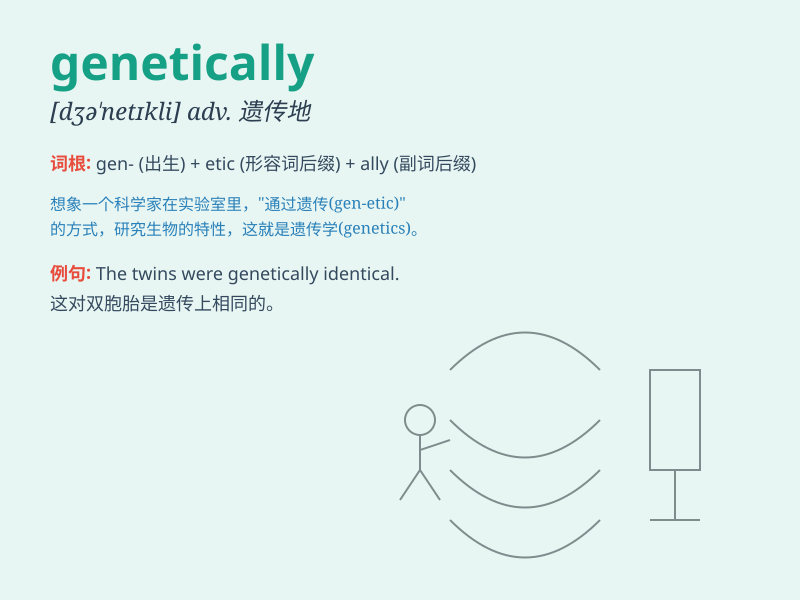

## genetically

**英音:** _[ˌdʒiːnəˈtiːkli]_ **美音:**
_[ˌdʒiːnəˈtiːkli]_

**译义:** *adv.从基因方面；遗传（基因）地*

### 短语

+ **genetically modified:** _转基因的_

+ **genetically engineered:** _基因工程的_

+ **genetically related:** _基因相关的_

+ **genetically determined:** _由基因决定的_

+ **genetically distinct:** _基因上不同的_

### 例句

#### 例句1

> **Genetically modified foods have raised concerns among some
consumers.**

**中文翻译:** 转基因食品在一些消费者中引起了担忧。

**单词释义:** 从基因方面；在基因上

#### 例句2

> **Some diseases are genetically inherited.**

**中文翻译:** 有些疾病是基因遗传的。

**单词释义:** 从基因方面；在基因上

#### 例句3

> **The two plants are genetically distinct.**

**中文翻译:** 这两种植物在基因上是不同的。

**单词释义:** 从基因方面；在基因上

### 背诵小故事

>
想象一个科学家在实验室里研究基因，他专注地探索着生物特征是如何从一代传递到下一代的。他口中不断念叨着\'genetically\'，意思就是'从基因方面；遗传地'。

**想象科学家研究基因的场景来记住genetically意为从基因方面；遗传地**

### 图义

