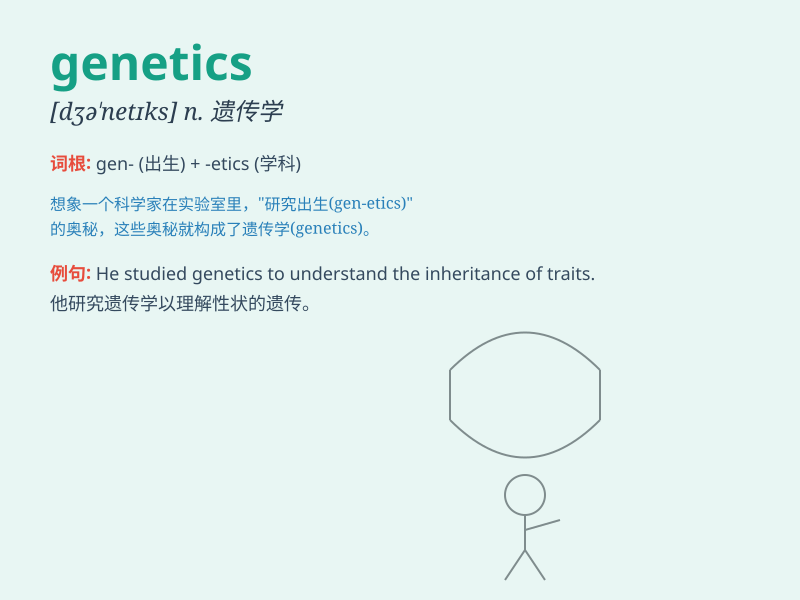

## genetics

**英音:** _[dʒɪ\'netɪks]_ **美音:** _[dʒə\'nɛtɪks]_

**译义:** *n.遗传学*

### 短语

+ **molecular genetics:** _分子遗传学_

+ **population genetics:** _群体遗传学_

+ **quantitative genetics:** _数量遗传学_

+ **medical genetics:** _医学遗传学_

+ **behavioral genetics:** _行为遗传学_

### 例句

#### 例句1

> **Genetics plays a crucial role in determining an individual\'s
susceptibility to certain diseases.**

**中文翻译:**
遗传学在确定个体对某些疾病的易感性方面起着至关重要的作用。

**单词释义:** 遗传学

#### 例句2

> **The study of genetics has advanced rapidly in recent years.**

**中文翻译:** 近年来，遗传学研究进展迅速。

**单词释义:** 遗传学

#### 例句3

> **She is majoring in genetics at the university.**

**中文翻译:** 她在大学主修遗传学。

**单词释义:** 遗传学

### 背诵小故事

> A scientist was deeply involved in genetics research. One day, he
discovered a key gene that could change the future of medicine. Genetics
is like a code that determines our traits and possibilities.

**一位科学家深入进行遗传学研究。有一天，他发现了一个关键基因，这可能会改变医学的未来。遗传学就像决定我们特征和可能性的密码。**

### 图义

