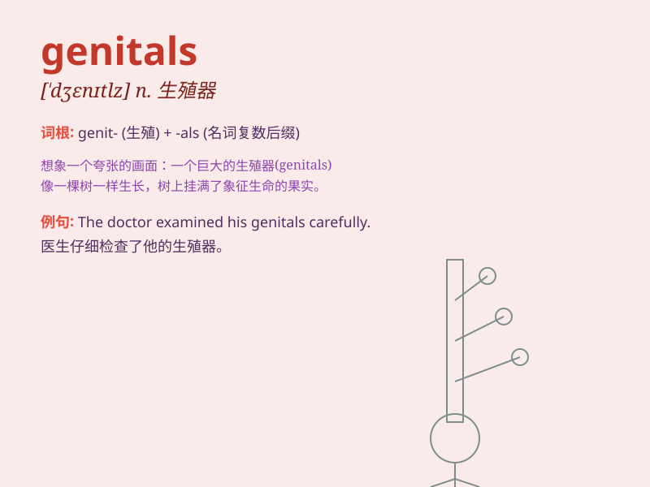

## genitals

**英音:** _[\'dʒenɪtəlz]_ **美音:** _[\'dʒɛnətlz]_

**译义:** *n.生殖器(尤指男性外生殖器)*

### 短语

+ **external genitals:** _外生殖器_

+ **male genitals:** _男性生殖器_

+ **female genitals:** _女性生殖器_

+ **genitals infection:** _生殖器感染_

+ **genitals hygiene:** _生殖器卫生_

### 例句

#### 例句1

> **The doctor examined the patient\'s genitals during the physical
examination.**

**中文翻译:** 医生在体检时检查了病人的生殖器。

**单词释义:** 生殖器

#### 例句2

> **Some diseases can affect the genitals and cause serious health
problems.**

**中文翻译:** 有些疾病会影响生殖器并导致严重的健康问题。

**单词释义:** 生殖器

#### 例句3

> **It\'s important to keep the genitals clean to prevent
infections.**

**中文翻译:** 保持生殖器清洁对于预防感染很重要。

**单词释义:** 生殖器

### 背诵小故事

> A young doctor was nervous on his first day at the hospital. When it
came to dealing with patients\' genitals, he took a deep breath and
reminded himself of his duty to provide professional care.

**一位年轻的医生在医院上班的第一天很紧张。当要处理病人的生殖器问题时，他深吸一口气，并提醒自己有提供专业护理的职责。**

### 图义

