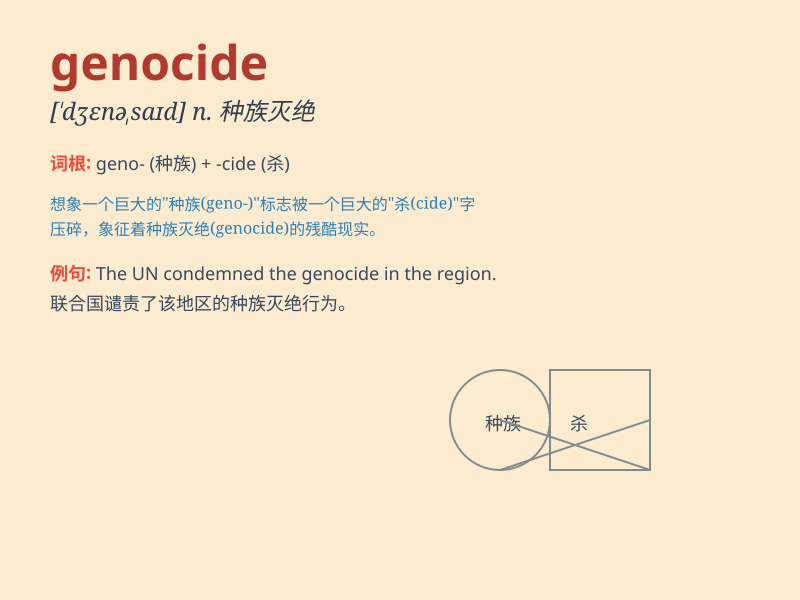

## genocide

**英音:** _[\'dʒenəsaɪd]_ **美音:** _[\'dʒɛnəsaɪd]_

**译义:** *n.有计划的灭种和屠杀*

### 短语

+ **commit genocide:** _进行种族灭绝_

+ **prevent genocide:** _防止种族灭绝_

+ **survivor of genocide:** _种族灭绝的幸存者_

+ **genocide awareness:** _对种族灭绝的认识_

+ **condemn genocide:** _谴责种族灭绝_

### 例句

#### 例句1

> **The international community condemns all forms of genocide.**

**中文翻译:** 国际社会谴责一切形式的种族灭绝。

**单词释义:** 种族灭绝

#### 例句2

> **The history of genocide is a painful reminder of humanity\'s
darkest moments.**

**中文翻译:** 种族灭绝的历史痛苦地提醒着人类最黑暗的时刻。

**单词释义:** 种族灭绝

#### 例句3

> **They are working to prevent genocide and protect human
rights.**

**中文翻译:** 他们正在努力防止种族灭绝和保护人权。

**单词释义:** 种族灭绝

### 背诵小故事

> In a distant land, a cruel leader planned a sinister act. He aimed to
eliminate an entire ethnic group, committing genocide. People fought
against this injustice, determined to stop the horror. Remember,
genocide means the deliberate killing of a large group of people.

**在一个遥远的地方，一位残忍的领导人策划了一个邪恶的行动。他旨在消灭整个族群，实施种族灭绝。人们奋起反抗这种不公正，决心阻止这场恐怖。记住，genocide
意思是种族灭绝。**

### 图义

