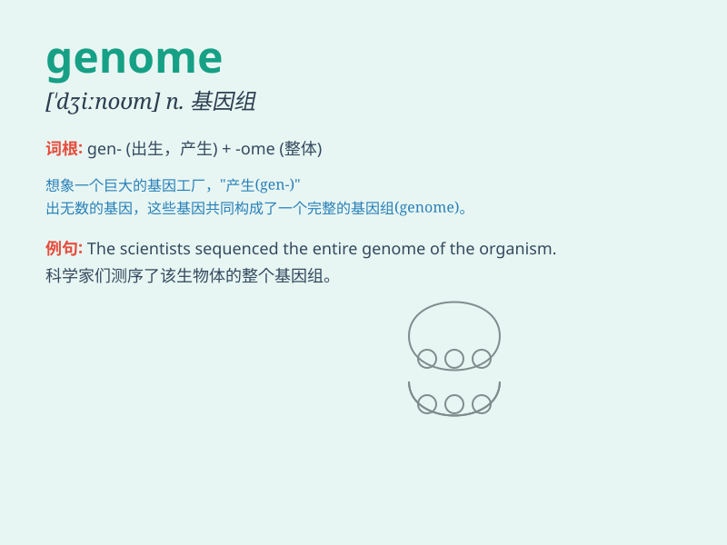

## genome

**英音:** _[\'dʒiːnəʊm]_ **美音:** _[\'dʒinom]_

**译义:** *n.[生]基因组,染色体组*

### 短语

+ **human genome:** _人类基因组_

+ **genome sequencing:** _基因组测序_

+ **genome analysis:** _基因组分析_

+ **plant genome:** _植物基因组_

+ **genome project:** _基因组计划_

### 例句

#### 例句1

> **The human genome contains about 20,000 to 25,000 genes.**

**中文翻译:** 人类基因组包含约 20,000 至 25,000 个基因。

**单词释义:** 基因组

#### 例句2

> **Scientists are studying the genome of the virus to develop a
vaccine.**

**中文翻译:** 科学家们正在研究病毒的基因组以开发疫苗。

**单词释义:** 基因组

#### 例句3

> **The sequencing of the plant genome was a major scientific
achievement.**

**中文翻译:** 植物基因组测序是一项重大科学成就。

**单词释义:** 基因组

### 背诵小故事

> Imagine a magical world where every living being has a secret code
book. This code book, called the \'genome\', holds all the instructions
needed to build and maintain that creature. It\'s like a blueprint for
life!

**想象一个神奇的世界，每个生物都有一本秘密的密码书。这本被称为"基因组"的密码书包含了构建和维持该生物所需的所有指令。它就像生命的蓝图！**

### 图义

