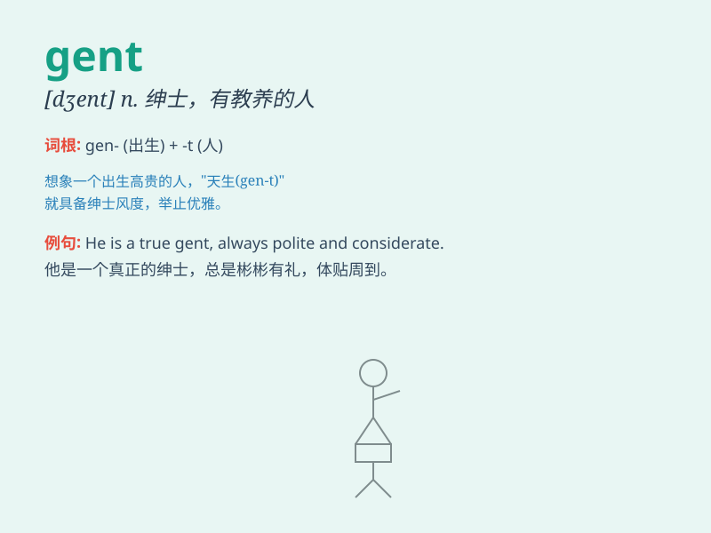

## gent

**英音:** _[dʒent]_ **美音:** _[dʒɛnt]_

**译义:** *n.绅士,假绅士 (pl.) 男厕*

### 短语

+ **ladies and gents:** _女士们先生们_

+ **gentleman\'s agreement:** _君子协定_

+ **old gent:** _老绅士_

+ **new gent:** _新绅士_

+ **young gent:** _年轻绅士_

### 例句

#### 例句1

> **He is a true gent, always polite and helpful.**

**中文翻译:** 他是一位真正的绅士，总是彬彬有礼，乐于助人。

**单词释义:** 绅士

#### 例句2

> **The old gent walked slowly along the street.**

**中文翻译:** 老先生沿着街道慢慢地走着。

**单词释义:** 绅士；先生

#### 例句3

> **The gents\' restroom is on the left.**

**中文翻译:** 男士洗手间位于左侧。

**单词释义:** 男厕所

### 背诵小故事

> Once upon a time, a young man named Jack was trying to enter a fancy
party. But the guard said, \'Only a gent can come in.\' Jack realized he
needed to be polite and well-dressed to be considered a gent.

**从前，有个叫杰克的年轻人试图进入一个豪华的派对。但保安说：'只有绅士才能进来。'杰克意识到他得有礼貌并且穿着得体才能被认为是一位绅士。**

### 图义

