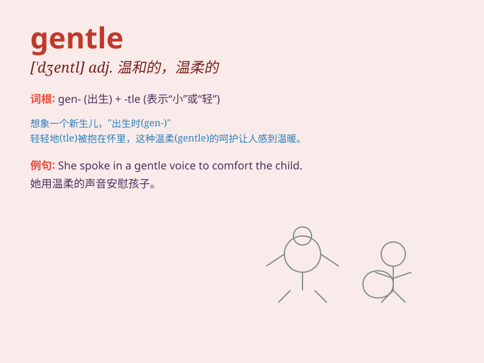

## gentle

**英音:** _[\'dʒent(ə)l]_ **美音:** _[\'dʒɛntl]_

**译义:** *adj.温和的,文雅的*

### 短语

+ **gentle breeze:** _微风_

+ **gentle slope:** _缓坡_

+ **gentle reminder:** _委婉的提醒_

+ **gentle nature:** _温和的性格_

+ **gentle touch:** _轻柔的触摸_

### 例句

#### 例句1

> **The gentle breeze blew through the trees.**

**中文翻译:** 柔和的微风吹过树林。

**单词释义:** 轻柔的

#### 例句2

> **He has a gentle nature and is always kind to others.**

**中文翻译:** 他性格温和，总是善待别人。

**单词释义:** 温和的

#### 例句3

> **The doctor\'s touch was gentle as he examined the patient.**

**中文翻译:** 医生检查病人时，动作很轻柔。

**单词释义:** 轻柔的

### 背诵小故事

> A little girl was lost in the forest. A gentle wind blew and seemed
to guide her. Then a gentle old man appeared and led her home safely.
The girl always remembered the gentle help.

**一个小女孩在森林里迷路了。一阵轻柔的风吹过，似乎在为她指引方向。然后一位温和的老人出现，安全地把她领回了家。女孩永远记得这份温柔的帮助。**

### 图义

