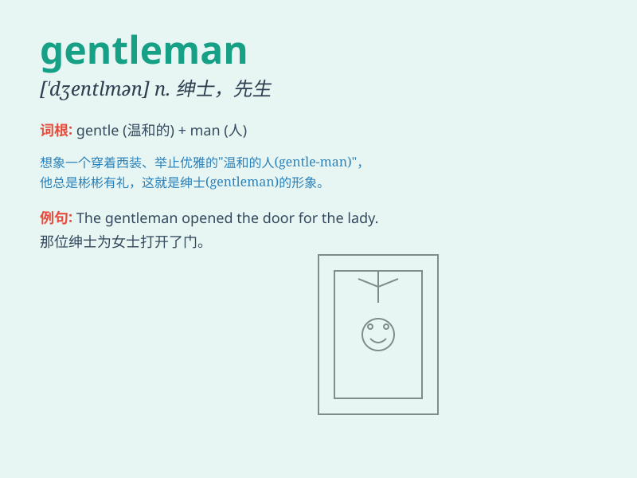

## gentleman

**英音:** _[\'dʒent(ə)lmən]_ **美音:** _[\'dʒɛntlmən]_

**译义:** *n.阁下,先生,有身分的人,绅士,[pl.] 男厕所,男盥洗室*

### 短语

+ **a gentleman at large:** _自由绅士_

+ **gentleman of fortune:** _冒险家；海盗_

+ **gentleman of the press:** _新闻记者_

+ **ladies and gentlemen:** _女士们、先生们_

+ **old gentleman:** _老先生_

### 例句

#### 例句1

> **He is a true gentleman, always polite and respectful to
others.**

**中文翻译:** 他是一位真正的绅士，总是彬彬有礼，尊重他人。

**单词释义:** 绅士；有教养的男子

#### 例句2

> **The gentleman opened the door for the lady.**

**中文翻译:** 先生为女士打开了门。

**单词释义:** 绅士；男士

#### 例句3

> **Gentlemen, please be seated.**

**中文翻译:** 先生们，请入座。

**单词释义:** 先生（复数）

### 背诵小故事

> Once upon a time, in a crowded train, a man gave up his seat to an
elderly lady. Everyone praised him as a gentleman. A gentleman is
someone polite, kind, and respectful, always behaving well in any
situation.

**从前，在拥挤的火车上，一个男人给一位年长的女士让座。每个人都称赞他是一位绅士。绅士就是有礼貌、善良、尊重他人，在任何情况下都表现良好的人。**

### 图义

