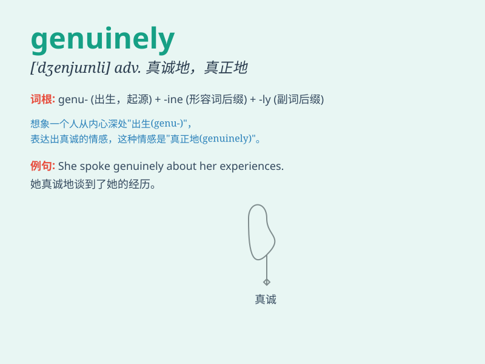

## genuinely

**英音:** _[\'dʒenjuɪnli]_ **美音:** _[ˈdʒenjuɪnli]_

**译义:** *adv.真诚地,诚实地*

### 短语

+ **genuinely concerned:** _真心关切_

+ **genuinely interested:** _真正感兴趣_

+ **genuinely sorry:** _真心抱歉_

+ **genuinely unique:** _真正独特_

+ **genuinely helpful:** _真正有帮助_

### 例句

#### 例句1

> **I genuinely enjoy reading books in my spare time.**

**中文翻译:** 我真的很喜欢在业余时间读书。

**单词释义:** 真正地；真诚地

#### 例句2

> **She genuinely cares about the well-being of others.**

**中文翻译:** 她真诚地关心他人的福祉。

**单词释义:** 真诚地；由衷地

#### 例句3

> **This is a genuinely unique opportunity that you shouldn\'t
miss.**

**中文翻译:** 这是一个真正独特的机会，您不应该错过。

**单词释义:** 真正地；确实地

### 背诵小故事

> One day, a man claimed to be a friend genuinely. But when trouble
came, only one stayed by your side. That\'s the true meaning of
genuinely, showing real and sincere feelings.

**一天，一个人声称是真心朋友。但当麻烦来临时，只有一个人留在你身边。这就是'genuinely'的真正含义，展现出真实和真诚的感情。**

### 图义

