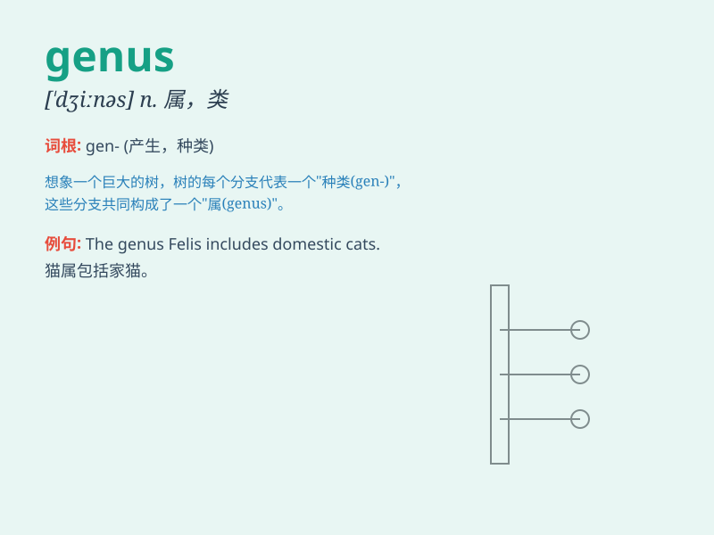

## genus

**英音:** _[\'dʒiːnəs; \'dʒenəs]_ **美音:** _[\'dʒinəs]_

**译义:** *n.种,类*

### 短语

+ **genus homo:** _人属_

+ **genus rosa:** _蔷薇属_

+ **genus canis:** _犬属_

+ **genus felis:** _猫属_

+ **genus mus:** _鼠属_

### 例句

#### 例句1

> **The rose is a genus of plants that includes many different
species.**

**中文翻译:** 玫瑰是一个植物属，包括许多不同的物种。

**单词释义:** 属

#### 例句2

> **This butterfly belongs to a rare genus.**

**中文翻译:** 这种蝴蝶属于稀有的属。

**单词释义:** 属

#### 例句3

> **The genus of this new virus is still under investigation.**

**中文翻译:** 这种新病毒的属仍在调查中。

**单词释义:** 属

### 背诵小故事

>
想象在一个神秘的森林里，有各种生物。科学家们为了分类，把相似的生物归为一组，这一组就叫
genus（属）。比如，猫科动物就是一个 genus ，包含了狮子、老虎等。

**想象在神秘森林中，科学家为分类将相似生物归为一组叫'属'，如猫科动物是一个'属'，含狮子、老虎等。**

### 图义

