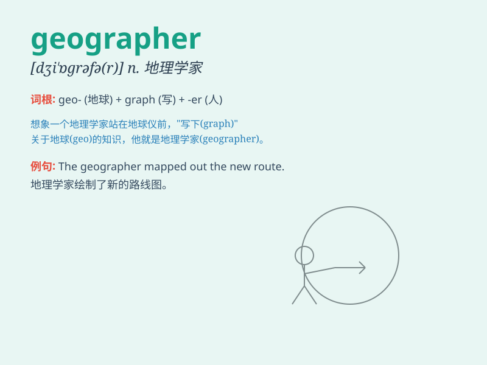

## geographer

**英音:** _[dʒɪ\'ɒɡrəfə]_ **美音:** _[dʒɪ\'ɑɡrəfɚ]_

**译义:** *n.地理学者*

### 短语

+ **professional geographer:** _专业地理学家_

+ **famous geographer:** _著名地理学家_

+ **experienced geographer:** _经验丰富的地理学家_

+ **young geographer:** _年轻的地理学家_

+ **academic geographer:** _学术地理学家_

### 例句

#### 例句1

> **The geographer is studying the landforms of the region.**

**中文翻译:** 地理学家正在研究该地区的地貌。

**单词释义:** 地理学家

#### 例句2

> **She dreams of becoming a famous geographer one day.**

**中文翻译:** 她梦想有一天成为一名著名的地理学家。

**单词释义:** 地理学家

#### 例句3

> **The geographer\'s research focuses on climate change.**

**中文翻译:** 地理学家的研究重点是气候变化。

**单词释义:** 地理学家

### 背诵小故事

> One day, a curious child named Lily met a wise old man. The man was a
geographer. He showed Lily maps and told her about different places on
Earth. Lily was amazed and remembered the word \'geographer\' easily.

**有一天，一个叫莉莉的好奇孩子遇到了一位智慧的老人。这位老人是一位地理学家。他给莉莉展示地图，并给她讲述地球上不同的地方。莉莉感到很惊奇，轻松记住了'geographer'这个单词。**

### 图义

