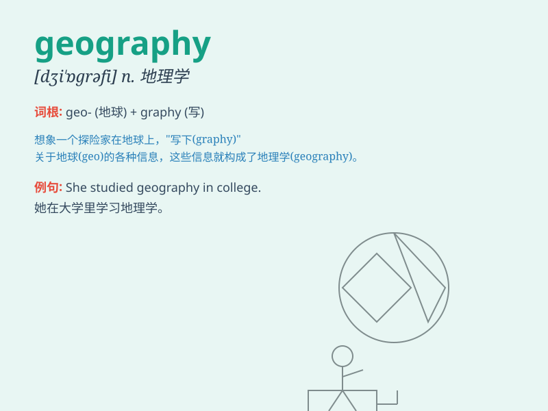

## geography

**英音:** _[dʒɪ\'ɒgrəfɪ]_ **美音:** _[dʒiˈɑɡrəfɪ]_

**译义:** *n.地理学,地理*

### 短语

+ **physical geography:** _自然地理_

+ **human geography:** _人文地理_

+ **economic geography:** _经济地理_

+ **geography teacher:** _地理老师_

+ **study geography:** _学习地理_

### 例句

#### 例句1

> **I have always been interested in geography.**

**中文翻译:** 我一直对地理很感兴趣。

**单词释义:** 地理（学科）

#### 例句2

> **The geography of this area is very complex.**

**中文翻译:** 该地区的地理非常复杂。

**单词释义:** 地理（情况、特征）

#### 例句3

> **He studied geography at university.**

**中文翻译:** 他在大学学习地理。

**单词释义:** 地理（学科）

### 背诵小故事

> One day, a little boy named Geo was lost. He needed to find his way
home. A kind fairy appeared and gave him a graphy to help. With the
graphy, Geo learned about land, mountains, and rivers, and finally found
his way. That\'s how he understood geography.

**有一天，一个叫Geo的小男孩迷路了。他需要找到回家的路。一个善良的仙女出现并给了他一张图表。凭借这张图表，Geo了解了土地、山脉和河流，最终找到了路。这就是他如何理解地理的。**

### 图义

